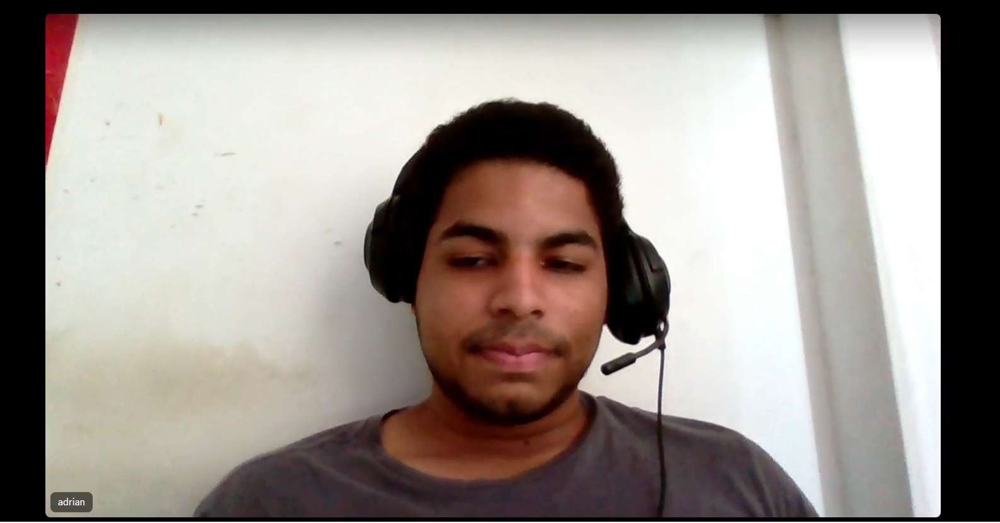
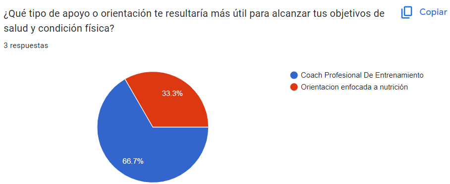
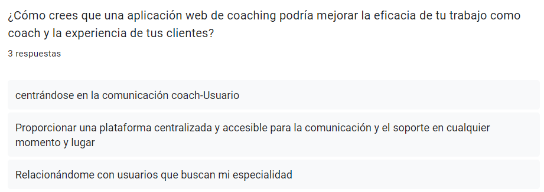
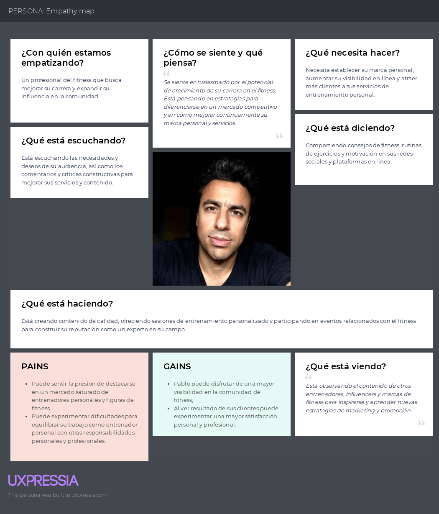

# **Capítulo II: Requirements Elicitation & Analysis**

## 2.1. Competidores

Se ha reconocido a Noom, Peloton y FitnessPal como los principales competidores de nuestro proyecto. Este análisis nos permitirá adquirir un conocimiento más profundo sobre el funcionamiento del mercado, así como las ventajas y desventajas que poseemos en comparación con ellos. Esta información será fundamental para desarrollar estrategias y tácticas efectivas dentro del sector seleccionado.

### 2.1.1. Análisis competitivo

<table>
  <tr>
    <th colspan="7" valign="top"><b>Competitive Analysis Landscape</b></th>
  </tr>
  <tr>
    <td colspan="2" rowspan="2">Objetivo del análisis</td>
    <td colspan="5">¿Cómo analiza, produce y enfrenta el mercado mi competencia?</td>
  </tr>
  <tr>
    <td colspan="5">Este análisis se realizó con la finalidad de poder identificar a nuestros potenciales competidores e idear estrategias y tácticas para diferenciarnos de estos.</td>
  </tr>
  <tr>
    <td colspan="3">Nombre y logo</td>
    <td colspan="1" valign="top" style="font-weight: bold;">
        GymPal
         
        

                
        

    <td colspan="1" valign="top" style="font-weight: bold;">
      Noom
        

                
        

    </td>
    <td colspan="1" valign="top" style="font-weight: bold;">
      Peloton
        

                
            

        </td>
    <td colspan="1" valign="top" style="font-weight: bold;" >
      MyFitnessPal
        

                
        

    </td>
  </tr>
  <tr>
    <td colspan="1" rowspan="2">
Perfil
</td>
    <td colspan="2">Overview</td>
    <td colspan="1" valign="top">Aplicación web que conecta a usuarios interesados en ejercitarse y mantener una alimentación saludable con nutriólogos y coaches especializados.</td>
    <td colspan="1" valign="top">Aplicación web que combina tecnología con coaching humano para ayudar a los usuarios a desarrollar hábitos saludables en torno a la alimentación, el ejercicio y el bienestar mental</td>
    <td colspan="1" valign="top">Aplicación web que proporciona acceso a una variedad de clases de fitness en vivo y bajo demanda, incluidas clases de ciclismo, carrera, yoga y más.</td>
    <td colspan="1" valign="top">Aplicación web que permite a los usuarios realizar un seguimiento detallado de su dieta y ejercicioy. Realiza un seguimiento del progreso físico a lo largo del tiempo.</td>
  </tr>
  <tr>
    <td colspan="2">Ventaja competitiva</td>
    <td colspan="1" valign="top">Permite a los usuarios conectar con nutriólogos y coaches especializados, recibiendo recomendaciones personalizadas y planes de acción para alcanzar sus objetivos de salud y fitness. Con características adicionales como seguimiento de progreso, registro de alimentos, y acceso a contenido exclusivo, nuestra plataforma ofrece una experiencia integral para ayudar a los usuarios a lograr sus metas de bienestar de manera efectiva y sostenible.</td>
    <td colspan="1" valign="top">Permite a los usuarios desarrollar hábitos saludables personalizados con el apoyo de coaches expertos, facilitando cambios de comportamiento positivos a largo plazo.</td>
    <td colspan="1" valign="top">Permite acceder a una amplia variedad de clases de fitness en vivo y bajo demanda desde la comodidad del hogar, proporcionando una experiencia interactiva y motivadora para los usuarios.</td>
    <td colspan="1" valign="top">Permite realizar un seguimiento detallado de la dieta y el ejercicio, ofreciendo una extensa base de datos de alimentos y ejercicios para ayudar a los usuarios a alcanzar sus objetivos de salud y fitness con mayor precisión y eficacia.</td>
  </tr>
  <tr>
    <td colspan="1" rowspan="2">
Perfil de Marketing
</td>
    <td colspan="2">Mercado objetivo</td>
    <td colspan="1" valign="top">Usuarios entre 18 y 65 años que buscan mejorar su salud y condición física a través de la combinación de ejercicio, alimentación saludable y asesoramiento profesional.</td>
    <td colspan="1" valign="top">Usuarios entre 18 y 65 años que buscan desarrollar hábitos saludables personalizados y recibir apoyo de coaches expertos para lograr cambios de comportamiento positivos a largo plazo.</td>
    <td colspan="1" valign="top">Usuarios entre 18 y 65 años que desean acceder a una amplia variedad de clases de fitness en vivo y bajo demanda desde la comodidad del hogar, buscando una experiencia interactiva y motivadora para mejorar su condición física.</td>
    <td colspan="1" valign="top">Usuarios entre 18 y 65 años que están interesados en realizar un seguimiento detallado de su dieta y ejercicio, utilizando una extensa base de datos de alimentos y ejercicios para alcanzar sus objetivos de salud y fitness de manera precisa y eficaz.</td>
  </tr>
  <tr>
    <td colspan="2">Estrategias de marketing</td>
    <td colspan="1" valign="top">GymPal realiza colaboraciones con influencers locales en el ámbito del fitness, la nutrición o el bienestar para promocionar tu aplicación. Estos influencers pueden tener una audiencia comprometida y localizada.</td>
    <td colspan="1" valign="top">Ofrecen contenido efectivo, creando y compartiendo artículos, videos y recursos relacionados con la salud, el fitness y la nutrición en sus canales digitales</td>
    <td colspan="1" valign="top">Ofrecen una amplia variedad de clases de fitness en vivo y bajo demanda a través de su plataforma</td>
    <td colspan="1" valign="top">Ofrecen a sus usuarios a compartir sus logros y progresos en las redes sociales utilizando el hashtag oficial de la marca.</td>
  </tr>
  <tr>
    <td colspan="1" rowspan="3">
Perfil de Producto
</td>
    <td colspan="2">Productos & Servicios</td>
    <td colspan="1" valign="top">-Permite a los usuarios conectarse con nutriólogos y coaches especializados en salud y fitness. - Proporciona recomendaciones personalizadas según los objetivos individuales de cada usuario, ya sea bajar de peso, definir músculos o aumentar volumen, entre otros. - Permite a los usuarios realizar un seguimiento de su progreso a lo largo del tiempo, ya sea en términos de peso, medidas, hábitos alimenticios o rendimiento en el ejercicio. - Facilita la conexión con nutriólogos, coaches independientes y gimnasios locales donde los    usuarios pueden recibir apoyo adicional y realizar sus ejercicios.
    </td>
    <td colspan="1" valign="top">-Ofrece coaching personalizado que combina tecnología avanzada con asesoramiento humano para ayudar a los usuarios a desarrollar hábitos saludables. -Proporciona herramientas y recursos para la planificación de comidas, incluyendo recetas saludables y sugerencias de alimentos. -Permite a los usuarios realizar un seguimiento de su progreso en términos de pérdida de peso, actividad física y hábitos alimenticios a lo largo del tiempo.</td>
    <td colspan="1" valign="top">-Ofrece una amplia variedad de clases de fitness en vivo y bajo demanda, que incluyen ciclismo, carrera, yoga y más. -Ofrece equipos de ejercicio en el hogar, como bicicletas estáticas y cintas de correr, para una experiencia completa de entrenamiento. -Fomenta la participación de la comunidad a través de eventos virtuales, grupos de apoyo y desafíos de fitness para mantener a los usuarios motivados y comprometidos.</td>
    <td colspan="1" valign="top">-Permite a los usuarios realizar un seguimiento detallado de su consumo de alimentos y actividad física, proporcionando datos y análisis para ayudar a alcanzar sus metas de salud y fitness. -Ofrece una amplia base de datos de alimentos que facilita a los usuarios encontrar y registrar información nutricional precisa sobre sus comidas. -Cuenta con una comunidad activa en línea donde los usuarios pueden compartir sus logros, obtener apoyo y motivación de otros miembros.</td>
  </tr>
  <tr>
      <td colspan="2">Precios & Costos</td>
      <td colspan="1" valign="top">-Test Plan: S/.0  -Monthy Plan: S/.19.90 -Annual Plan: S/.249.9.</td>
      <td colspan="1" valign="top">-Periodo de prueba (7 a 14 dias): $0.50 hasta $18. -Plan mensual de renovación automática: $70 USD por mes. -Plan anual de renovacion automatica:  $17.50 USD por mes.</td>
      <td colspan="1" valign="top">Los precios pueden incluir el costo inicial del equipo (como bicicletas estáticas o cintas de correr) más una tarifa mensual de suscripción que suele rondar los $39 al mes para acceso completo a clases y contenido exclusivo.</td>
      <td colspan="1" valign="top">-Free: $0 (seguimiento de la dieta y el ejercicio) -Premium: $19.99 mensual</td>
  </tr>
  <tr>
    <td colspan="2">Canales de distribución (Web y/o Móvil)</td>
    <td colspan="1" valign="top">Redes sociales y aplicación web</td>
    <td colspan="1" valign="top">Página web y aplicación móvil</td>
    <td colspan="1" valign="top">Página web y aplicación móvil</td>
    <td colspan="1" valign="top">Página web y aplicación móvil</td>
  </tr>
  <tr>
    <td colspan="1" rowspan="5">
Análisis SWOT
</td>
    <td colspan="6">Realice esto para su startup y sus competidores. Sus fortalezas deberían apoyar sus oportunidades y contribuir a lo que ustedes definen como su posible ventaja competitiva.</td>
  </tr>
  <tr>
    <td colspan="2">Fortalezas</td>
    <td colspan="1" valign="top">Conexión directa con nutriólogos y coachs</td>
    <td colspan="1" valign="top">Ofrece recomendaciones y seguimiento personalizados basados en datos de usuario</td>
    <td colspan="1" valign="top">Comunidad comprometida</td>
    <td colspan="1" valign="top">Amplia base de datos de alimentosInterfaz fácil de usar.</td>
  </tr>
  <tr>
    <td colspan="2">Debilidades</td>
    <td colspan="1" valign="top">Dependencia de la disponibilidad de profesionales</td>
    <td colspan="1" valign="top">Costo de suscripción</td>
    <td colspan="1" valign="top">Costo inicial elevado Dependencia del equipo</td>
    <td colspan="1" valign="top">La versión gratuita de MyFitnessPal muestra anuncios intrusivos que pueden afectar la experiencia del usuario y disminuir la satisfacción.</td>
  </tr>
  <tr>
    <td colspan="2">Oportunidades</td>
    <td colspan="1" valign="top">Explorar la posibilidad de ofrecer servicios adicionales, como planes de comida personalizados o seguimiento de progreso a largo plazo.</td>
    <td colspan="1" valign="top">La expansión a mercados internacionales ofrece oportunidades para llegar a nuevas audiencias y aumentar la base de usuarios.</td>
    <td colspan="1" valign="top">Peloton puede expandir su oferta de clases y contenido para cubrir una variedad aún más amplia de intereses y necesidades de fitness.</td>
    <td colspan="1" valign="top">Integración con dispositivos de fitness populares, como Fitbit o Garmin, para proporcionar a los usuarios una experiencia más completa y personalizada.</td>
  </tr>
  <tr>
    <td colspan="2">Amenazas</td>
    <td colspan="1" valign="top">Competencia creciente</td>
    <td colspan="1" valign="top">Cambios en las tendencias de salud o en las preferencias del consumido</td>
    <td colspan="1" valign="top">Cambios en las preferencias del consumidor.</td>
    <td colspan="1" valign="top">La competencia en el mercado de aplicaciones de salud y fitness es feroz, con una variedad de opciones disponibles para los usuarios</td>
  </tr>
</table>

### 2.1.2. Estrategias y tácticas frente a competidores

Nuestro enfoque principal radica en ofrecer una experiencia de usuario excepcional, lo que nos diferenciará de la competencia. Nos comprometemos a garantizar que nuestra aplicación sea intuitiva, atractiva visualmente y repleta de características útiles que superen las expectativas de nuestros usuarios.

Destacaremos las características únicas de nuestra aplicación, resaltando un enfoque personalizado en la conexión entre usuarios y profesionales de la salud, además de incluir contenido exclusivo e integrar tecnología innovadora.
Enfatizaremos la capacidad de nuestra aplicación para adaptarse a las necesidades individuales de los usuarios, ofreciendo recomendaciones personalizadas y ajustes basados en datos recopilados, utilizando algoritmos avanzados y solicitando retroalimentación regular de los usuarios.
Estableceremos asociaciones con influencers, nutriólogos reconocidos y entrenadores personales para aumentar la credibilidad y la visibilidad de nuestra aplicación, organizando eventos de lanzamiento y colaboraciones específicas para generar interés y confianza en nuestra marca.
Atender las necesidades y comentarios de nuestros usuarios para brindar un servicio al cliente sobresaliente es fundamental para destacarnos en comparación con la competencia. Esto nos permite garantizar una experiencia positiva y cultivar la lealtad de nuestros usuarios existentes, al mismo tiempo que atraemos a nuevos clientes hacia nuestra plataforma.

## 2.2. Entrevistas

El propósito de las entrevistas es adquirir una comprensión profunda de las experiencias, perspectivas y opiniones de los segmentos de mercado seleccionados. Nuestro objetivo es obtener información valiosa que nos ayude a entender mejor a nuestro público objetivo y así mejorar nuestro conocimiento sobre los usuarios. Estas conversaciones nos permitirán obtener una visión más clara de las necesidades y deseos de nuestros usuarios, lo que nos ayudará a adaptar nuestros productos o servicios de manera más efectiva a sus requerimientos.
### 2.2.1. Diseño de entrevistas.
* **Individuos interesados en mejorar su salud y condición física:**
1. ¿Qué te ha motivado a buscar maneras de mejorar tu salud y condición física en este momento?
2. ¿Cuál ha sido tu experiencia previa al intentar adoptar un estilo de vida más saludable? ¿Qué obstáculos has enfrentado?
3. ¿Qué tipo de apoyo o orientación te resultaría más útil para alcanzar tus objetivos de salud y condición física?
4. ¿Cómo crees que una Aplicación web de coaching en línea podría ayudarte a mantenerte motivado y comprometido con tus metas de bienestar?
5. ¿Qué características considerarías más importantes al elegir un servicio de coaching en línea para ayudarte a alcanzar tus objetivos de salud y condición física?
6. ¿Qué esperas obtener de un coach profesional en términos de apoyo y seguimiento en tu viaje hacia un estilo de vida más saludable?

* **Profesionales del coaching en ejercicio y alimentación:**
1. ¿Qué te llevó a convertirte en un profesional del coaching en ejercicio o alimentación?
2. ¿Cuáles son los mayores desafíos que enfrentas al trabajar con clientes de manera presencial?
3. ¿Qué beneficios ves en la posibilidad de ofrecer servicios de coaching en línea?
4. ¿Qué herramientas o características crees que serían más útiles para ti al proporcionar servicios de coaching en línea a tus clientes?
5. ¿Qué aspectos considerarías críticos al seleccionar una plataforma de coaching en línea para ofrecer tus servicios profesionales?
6. ¿Cómo crees que una aplicación web de coaching  podría mejorar la eficacia de tu trabajo como coach y la experiencia de tus clientes?
### 2.2.2. Registro de entrevistas

- **Individuos interesados en mejorar su salud y condición física:**

**Entrevista #1**

Nombre y apellidos: Diego Cancho  
Edad: 21  

[URL para ir a la entrevista](https://upcedupe-my.sharepoint.com/:v:/g/personal/u202120344_upc_edu_pe/EWSf1w7i4JxPq8WlSRjGIncBmWaN7kAUODPBPter0QruxQ?nav=eyJyZWZlcnJhbEluZm8iOnsicmVmZXJyYWxBcHAiOiJTdHJlYW1XZWJBcHAiLCJyZWZlcnJhbFZpZXciOiJTaGFyZURpYWxvZy1MaW5rIiwicmVmZXJyYWxBcHBQbGF0Zm9ybSI6IldlYiIsInJlZmVycmFsTW9kZSI6InZpZXcifX0%3D&e=tAhwcy)

 
Imagen 2 - Entrevista 1

**Resumen de la entrevista:** <td>El entrevistado nos cuenta sobre cómo ganó su interés de tener una vida más saludable enfocada en ejercicio. Esto es porque se dio cuenta que realizar actividades físicas lo ayuda a relajarse del estrés que frecuenta en su día a día. También que lo que más se le dificultaba antes para poder seguir esta vida fitness, es el no tener un horario fijo que lo presionara a seguir su rutina. Nos comenta que le gustaría poder tener un coach a su lado para que este le pueda guiar en cómo hacer sus ejercicios de manera correcta pero estos coaches no suelen estar en un solo lugar ni se quedan a su lado hasta que él termine su rutina, por lo que le gustaría tener un coach más accesible desde su celular o laptop.</td>

- - -
**Entrevista #2**

Nombre y apellidos: Angel Fabian  
Edad: 19  

[URL para ir a la entrevista](https://upcedupe-my.sharepoint.com/:v:/g/personal/u202219266_upc_edu_pe/EXm6qkvLSXpOmnlmbQjtqDEBD06cOCpi1ZF77g4czf08BQ?e=uz0q7j&nav=eyJyZWZlcnJhbEluZm8iOnsicmVmZXJyYWxBcHAiOiJTdHJlYW1XZWJBcHAiLCJyZWZlcnJhbFZpZXciOiJTaGFyZURpYWxvZy1MaW5rIiwicmVmZXJyYWxBcHBQbGF0Zm9ybSI6IldlYiIsInJlZmVycmFsTW9kZSI6InZpZXcifX0%3D)

 
Imagen 3 - Entrevista 2

**Resumen de la entrevista:** <td> El entrevistado nos cuenta sobre qué lo motivó a mejorar su salud y condición física. Esto porque quería mejorar su aspecto físico y no tener que comprar ropa ancha.
También cuenta qué experiencias y obstáculos tuvo al adoptar este nuevo estilo de vida saludable.
Finalmente nos cuenta que lo que espera de un coach es que lo incentive dándole metas y apoyo con las rutinas y la alimentación.
 </td>
- - -

**Entrevista #3**  
Nombre y apellidos:   
Edad:  

[URL_de_entrevista#3-1]()

 
Imagen 4 - Entrevista 3

**Resumen de la entrevista:**

- - -
- **Profesionales del coaching en ejercicio y alimentación:**

**Entrevista #1**

Nombre y apellidos: Adrián Valerio  
Edad: 22 años  

[URL para ir a la entrevista](https://upcedupe-my.sharepoint.com/:v:/g/personal/u20221c936_upc_edu_pe/Efz8wi4LvnlNiIB_odnblJQBRQBBJHxhK5xwB2Axk4o2oQ?e=jDPaet&nav=eyJyZWZlcnJhbEluZm8iOnsicmVmZXJyYWxBcHAiOiJTdHJlYW1XZWJBcHAiLCJyZWZlcnJhbFZpZXciOiJTaGFyZURpYWxvZy1MaW5rIiwicmVmZXJyYWxBcHBQbGF0Zm9ybSI6IldlYiIsInJlZmVycmFsTW9kZSI6InZpZXcifX0%3D)

 
Imagen 5 - Entrevista 1

**Resumen de la entrevista:** El entrevistado nos comenta a cerca de su gran interés a cerca de la actividad física cuando niño, por ello estudió y en estos momentos está sacando una certificación de coaching profesional mientras ejerce su carrera a sus 22 años. Para él, la comunicación usuario-coach es de lo más importante, y más si es virtual, pues, Adrián nos indica que hay una gran ventaja a comparación de la virtualidad, ya que feedbacks, consejos y regulaciones que brinda a sus usuarios puede ser más consistente, ya que la disponibilidad es más grande.

**Entrevista #2**

Nombre y apellidos:   
Edad:  
[URL_De_Entrevista]()

 
Imagen 6 - Entrevista 2

**Resumen de la entrevista:**

### 2.2.3. Análisis de entrevistas.
- #### Analisis Primer Segmento:

Este análisis sugiere que ambos entrevistados comparten similitudes en términos de motivación, desafíos enfrentados y expectativas del servicio de coaching en línea. Identificar estas características comunes nos permitirá ayudar a orientar el diseño y desarrollo de la aplicación web para satisfacer las necesidades y expectativas de este grupo objetivo.

- #### Analisis Segundo Segmento:

Características comunes:

- **Motivación y pasión**: Todos los entrevistados muestran una fuerte motivación y pasión por el campo del coaching en ejercicio y alimentación, destacando su deseo de ayudar a otros a mejorar su salud y bienestar.
- **Reconocimiento de desafíos**: Los entrevistados reconocen los desafíos asociados con el trabajo presencial, como las limitaciones geográficas y la dificultad para mantener la consistencia en las sesiones.
- **Interés en la virtualidad**: Todos expresan un claro entusiasmo por los beneficios potenciales de ofrecer servicios de coaching en línea, como la eliminación de barreras geográficas y una mayor flexibilidad para ellos y sus clientes.
- **Importancia de herramientas y características esenciales**: Resaltan la importancia de herramientas como la comunicación en tiempo real, el seguimiento del progreso y los recursos educativos en una plataforma en línea para brindar un servicio efectivo.
- **Mejora de la eficacia laboral**: Todos destacan cómo una aplicación web de coaching podría mejorar

## 2.3. Needfinding

### 2.3.1. User Personas

<strong>Segmento objetivo: Usuario</strong>

<strong>Segmento objetivo: Entrenador</strong>

<strong>Segmento objetivo: Nutricionista</strong>

### 2.3.2. User Task Matrix

<table align="center" border="1" width="90%" style="text-align:center;">
    <tr>
        <td>User Task Matrix</td>
        <td colspan=2>
            Usuarios interesados en mejorar su salud y estado físico
        </td>
        <td colspan=2>
            Profesionales de la salud y el fitness
        </td>
    </tr>
    <tr>
        <td>
        </td>
        <td>
            <b>Frequency</b>
        </td>
        <td>
            <b>Importance</b>
        </td>
        <td>
            <b>Frequency</b>
        </td>
        <td>
            <b>Importance</b>
        </td>
    </tr>
    <tr>
        <td>
            Establecer objetivos de salud y fitness
        </td>
        <td>
            Alta
        </td>
        <td>
            Siempre
        </td>
        <td>
            Alta
        </td>
        <td>
            Baja
        </td>
    </tr>
    <tr>
        <td>
            Buscar y conectarse con nutriólogos y coaches
        </td>
        <td>
            Alta
        </td>
        <td>
            Alta
        </td>
        <td>
            Alta
        </td>
        <td>
            Baja
        </td>
    </tr>
    <tr>
        <td>
            Recibir recomendaciones personalizadas sobre dieta y ejercicio.
        </td>
        <td>
            Alta
        </td>
        <td>
            A menudo
        </td>
        <td>
            Alta
        </td>
        <td>
            A veces
        </td>
    </tr>
     <tr>
        <td>
            Realizar seguimiento de la ingesta de alimentos y calorías.
        </td>
        <td>
            Alta
        </td>
        <td>
            Siempre
        </td>
        <td>
            Alta
        </td>
        <td>
            Baja
        </td>
    </tr>
     <tr>
        <td>
            Registrar actividades físicas y ejercicios realizados.
        </td>
        <td>
            Alta
        </td>
        <td>
            A menudo
        </td>
        <td>
            Alta
        </td>
        <td>
            A veces
        </td>
    </tr>
     <tr>
        <td>
            Consultar el progreso hacia los objetivos de salud.
        </td>
        <td>
            Alta
        </td>
        <td>
            Siempre
        </td>
        <td>
            Alta
        </td>
        <td>
            A veces
        </td>
    </tr>
     <tr>
        <td>
            Solicitar seguimiento y retroalimentación de los profesionales de la salud
        </td>
        <td>
            Alta
        </td>
        <td>
            A veces
        </td>
        <td>
            Alta
        </td>
        <td>
            A menudo
        </td>
    </tr>
     <tr>
        <td>
            Programar recordatorios y alarmas para actividades diarias
        </td>
        <td>
            Alta
        </td>
        <td>
            A menudo
        </td>
        <td>
            Alta
        </td>
        <td>
            A veces
        </td>
    </tr>
     <tr>
        <td>
            Interactuar con otros usuarios en la comunidad de la aplicación
        </td>
        <td>
            Alta
        </td>
        <td>
            A menudo
        </td>
        <td>
            Alta
        </td>
        <td>
            A veces
        </td>
    </tr>
     <tr>
        <td>
            Explorar programas de entrenamiento específicos
        </td>
        <td>
            Alta
        </td>
        <td>
            A menudo
        </td>
        <td>
            Alta
        </td>
        <td>
            Baja
        </td>
    </tr>
</table>

### 2.3.3. User Journey Mapping

<strong>Segmento objetivo: Usuario</strong>

<strong>Segmento objetivo: Entrenador</strong>

<strong>Segmento objetivo:: Nutricionista</strong>

### 2.3.4. Empathy Mapping

<strong>Segmento objetivo: Usuario</strong>

<strong>Segmento objetivo: Entrenador</strong>

<strong>Segmento objetivo: Nutricionista </strong>

### 2.3.5. As-is Scenario Mapping

<strong>Segmento objetivo: Usuario</strong>

<strong>Segmento objetivo: Entrenador</strong>

<strong>Segmento objetivo: Nutricionista </strong>

## 2.4. Ubiquitous Language

1. **Landing Page:** La página web inicial a la que llegan los usuarios cuando visitan el sitio de reserva de viajes. En el lenguaje ubicuo, podría ser simplemente "Página de Inicio" o "Página Principal".

2. **Nutricionista**: Un profesional especializado en el estudio de la nutrición y sus efectos en la salud. En el contexto de nuestra aplicación, un nutricionista proporciona recomendaciones dietéticas personalizadas y orientación a los usuarios.

3. **Entrenador de Fitness**: Una persona capacitada para diseñar programas de fitness y proporcionar orientación y motivación a las personas que buscan mejorar su salud física y niveles de condición física.

4. **Establecimiento de Objetivos**: El proceso de identificar objetivos específicos y medibles que un individuo desea lograr dentro de un cierto período de tiempo. En nuestra aplicación, los usuarios pueden establecer objetivos relacionados con la pérdida de peso, el aumento de masa muscular o la mejora general de la condición física.

5. **Seguimiento de Comidas**: La práctica de registrar y monitorear los tipos y cantidades de alimentos consumidos a lo largo del día. Los usuarios pueden hacer un seguimiento de sus comidas usando nuestra aplicación para obtener información sobre sus hábitos alimenticios y progreso hacia sus objetivos nutricionales.

6. **Registro de Ejercicios**: El acto de documentar las actividades físicas y los entrenamientos completados por un individuo. Nuestra aplicación permite a los usuarios registrar sus sesiones de ejercicio, incluyendo duración, intensidad y tipo de actividad, para seguir su progreso físico.

7. **Evaluación de Salud**: Una evaluación integral del estado de salud actual de un individuo, que incluye factores como la composición corporal, la salud cardiovascular y la función metabólica. Los usuarios pueden someterse a una evaluación de salud al comenzar el programa para establecer mediciones y objetivos de referencia.

8. **Monitoreo de Progreso**: El proceso continuo de seguimiento y evaluación de los cambios en métricas clave de salud y condición física con el tiempo. Nuestra aplicación proporciona herramientas para que los usuarios monitoreen su progreso, como cambios de peso, medidas corporales y mejoras en el rendimiento de los ejercicios.

9. **Cambio de Comportamiento**: El proceso de adoptar nuevos hábitos y elecciones de estilo de vida para apoyar objetivos de salud y condición física a largo plazo. Nuestra aplicación se centra en ayudar a los usuarios a desarrollar cambios de comportamiento sostenibles a través de la educación, motivación y coaching personalizado.

10. **Apoyo Comunitario**: Una red de apoyo de individuos con objetivos de salud y condición física similares que brindan aliento, responsabilidad y motivación mutua. Nuestra aplicación fomenta un sentido de comunidad entre los usuarios a través de funciones como desafíos grupales, foros y compartición social.

11. **Plan de Suscripción**: Una opción de membresía paga que otorga a los usuarios acceso a funciones y contenido premium dentro de la aplicación por un período especificado, generalmente mensual o anual. Los usuarios pueden elegir entre varios planes de suscripción según sus necesidades y preferencias.

12. **Consulta**: Una sesión individual con un profesional de la salud o un entrenador de fitness para discutir objetivos, recibir orientación personalizada y establecer un plan de acción.

13. **Registro de Progreso**: El proceso de documentar y visualizar los cambios y mejoras en el rendimiento físico y la salud a lo largo del tiempo, utilizando datos como medidas corporales, gráficos de peso y registros de ejercicios.

14. **Hábitos Saludables**: Comportamientos y prácticas diarias que contribuyen al bienestar físico, mental y emocional, como dormir lo suficiente, mantenerse hidratado y practicar ejercicio regularmente.

15. **Foro de Discusión**: Una plataforma en línea donde los usuarios pueden intercambiar ideas, hacer preguntas, compartir experiencias y brindar apoyo mutuo relacionado con la salud y el fitness.
