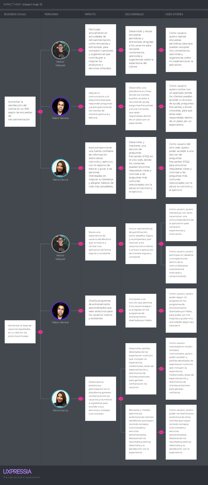

# **Capítulo III: Requirements Specification**
## 3.1. To-Be Scenario Mapping

Basado en nuestras soluciones elaboramos un to be Scenario Mapping para observar cómo es que nuestras ideas podrían abordar las necesidades del usuario.

<strong>Segmento objetivo: Usuario</strong>

| USER PERSON |  | HÉCTOR VÁZQUEZ |  |
|-----------|-----------|-----------|-----------|
| PHASES    |    Búsqueda de información sobre programas de entrenamiento        |     Selección de un programa de entrenamiento adecuado a sus necesidades y objetivos      |       Inscripción en el programa de entrenamiento elegido.    |
| DOING    |     Hace uso de la aplicación web explorando diferentes tipos de programas de entrenamiento, incluyendo ejercicios específicos, duración y niveles de intensidad  |     Investiga en línea sobre las opciones disponibles y compara características como la duración del programa, el enfoque de entrenamiento y las revisiones de otros usuarios     |     Completa el proceso de registro en línea para inscribirte en el programa de entrenamiento seleccionado, proporcionando la información necesaria y realizando el pago si es necesario.      |
| THINKING    |      Piensa que evaluar detenidamente sus metas personales de fitness te ayudará a encontrar el programa más adecuado para ti     |      Piensa que es importante evaluar cuidadosamente cada opción de programa de entrenamiento para garantizar que se alinee con tus metas de fitness.     |     Piensa que al inscribirte en el programa adecuado, estás dando un paso significativo hacia el logro de tus objetivos de fitness personales.      |
| FEELING    |     Se siente intrigado por las diferentes opciones de programas de entrenamiento disponibles      |     Se siente abrumado por la cantidad de opciones disponibles y tener dificultades para decidir cuál es la mejor para él.      |     Se siente satisfecho al dar el primer paso hacia el logro de sus objetivos de fitness.      |
 

<strong>Segmento objetivo: Entrenador</strong>

| USER PERSON |  | Pablo Herrera |  |
|-----------|-----------|-----------|-----------|
| PHASES    |     Diseña programas de entrenamiento adaptados a las necesidades y objetivos de cada cliente      |   Proporciona información detallada sobre los diferentes programas de entrenamiento disponibles        | Asegura que el cliente esté satisfecho con el programa de entrenamiento propuesto y lo acepte
| DOING    |     Guía al cliente a través de cada ejercicio y actividad incluido en el programa de entrenamiento      |     Monitorea el progreso del cliente y realiza ajustes en el programa de entrenamiento según sea necesario para garantizar resultados óptimos      |  Proporciona aliento constante y motivación al cliente para mantener su compromiso con el programa de entrenamiento
| THINKING    |     Piensa que evaluar el progreso del cliente en relación con los objetivos de entrenamiento establecidos y analizar su desempeño es crucial para ajustar el programa según sea necesario      |     Piensa que reflexionar sobre la efectividad del programa actual y considerar si se requieren ajustes para abordar las necesidades cambiantes del cliente es una parte importante de su trabajo como entrenador      |  Piensa en formas creativas de mantener al cliente comprometido y motivado.
| FEELING    |     Se siente satisfecho al evaluar el progreso del cliente y analizar su desempeño durante las sesiones de entrenamiento      |     Se siente preocupado por la efectividad del programa actual y su impacto en el éxito del cliente      | Se siente motivado al mantener al cliente comprometido y satisfecho con su progreso y resultados

 

<strong>Segmento objetivo: Nutricionista</strong>

| USER PERSON |  | Maria Garcia |  |
|-----------|-----------|-----------|-----------|
| PHASES   | Revisa el historial médico y los hábitos alimenticios del cliente antes de la consulta | Proporciona orientación nutricional detallada y basada en evidencia durante la consulta | Sigue en contacto con el cliente a través de la aplicación para brindar apoyo continuo
| DOING    | Accede y analiza información del cliente para comprender su situación de salud y patrones alimenticios | Durante la consulta, María proporciona orientación detallada y basada en evidencia, adaptada a las necesidades específicas de cada cliente | Se mantiene en contacto con el cliente a través de la aplicación para brindar apoyo continuo, ofreciendo motivación, resolviendo dudas y ajustando las recomendaciones según sea necesario
| THINKING    | Piensa en como los datos recopilados pueden proporcionar una visión completa de la salud del cliente y orientar las recomendaciones futuras | Piensa en como adaptar las recomendaciones para abordar las necesidades específicas del cliente y ayudarlo a alcanzar sus objetivos de salud |  Piensa en estrategias para mantener la motivación del cliente y proporcionar orientación constante a medida que avanza en su viaje de salud y bienestar
| FEELING    | Siente confianza al obtener información detallada para ofrecer recomendaciones precisas y personalizadas | Siente satisfacción al ayudar al cliente a comprender y mejorar su relación con la alimentación y la salud | Siente gratificación al ver el progreso del cliente y saber que su guía está marcando una diferencia positiva en su bienestar
 

## 3.2. User Stories

| Epic / Story ID | Título | Descripción | Criterios de Aceptación | Epic ID |
|-----------------|--------|-------------|-------------------------|---------|
| EP01/US01       | Creación de cuenta de usuario   | Como usuario, quiero poder crear una cuenta para acceder a todas las funcionalidades de la aplicación. | Given que el usuario ha ingresado sus datos de registro correctamente,   When el usuario hace clic en el botón "Registrarse",   Then se crea exitosamente la cuenta del usuario. Luego, debe iniciar sesión y seleccionar un plan. | EP01
| EP01/US02 | Establecimiento de objetivos de salud y fitness | Como usuario, quiero establecer mis objetivos de salud y fitness al registrarme en la aplicación. | Given que el usuario ha iniciado sesión en su cuenta,   When el usuario selecciona la opción "Establecer objetivos" en su perfil,   Then el usuario puede ingresar sus metas de salud y fitness, incluyendo peso objetivo, porcentaje de grasa corporal, etc. | EP01 |
| EP02/US03 | Recibir recomendaciones personalizadas sobre dieta y ejercicio | Como usuario, quiero recibir recomendaciones personalizadas sobre dieta y ejercicio basadas en mis objetivos y preferencias. | Given que el usuario ha ingresado su información de perfil y metas de fitness,  When el sistema procesa los datos del usuario,  Then el usuario recibe recomendaciones personalizadas sobre dieta y ejercicio basadas en sus metas y preferencias. | EP02 |
| EP03/US01 | Registro y seguimiento de la ingesta diaria de alimentos y calorías | Como usuario, quiero poder registrar y realizar un seguimiento de mi ingesta diaria de alimentos y calorías. | Given que el usuario ha ingresado su comida diaria en la aplicación,  When el usuario guarda la entrada de comida,  Then la aplicación registra y sigue la ingesta diaria de alimentos y calorías del usuario. | EP03 |
| EP02/US04 | Registro y seguimiento de actividades físicas y ejercicios | Como usuario, quiero poder registrar y hacer un seguimiento de todas mis actividades físicas y ejercicios realizados. | Given que el usuario ha completado una sesión de ejercicio o actividad física,  When el usuario registra la actividad en la aplicación,  Then la aplicación registra y sigue la actividad física y los ejercicios del usuario. | EP02 |
| EP04/US01 | Interacción en la comunidad de la aplicación | Como usuario, quiero interactuar con otros usuarios en una comunidad dentro de la aplicación para compartir experiencias y motivación. | Given que el usuario ha iniciado sesión en la aplicación,  When el usuario navega a la sección de comunidad o foros,  Then el usuario puede interactuar con otros miembros de la comunidad, publicar preguntas, respuestas, etc. | EP04 |
| EP06/US01 | Acceso a herramientas de análisis de datos | Como usuario, quiero acceder a herramientas de análisis y visualización de datos para comprender mejor mi progreso y áreas de mejora. | Given que el usuario ha ingresado a su cuenta en la aplicación,  When el usuario accede a las herramientas de análisis de datos,  Then el usuario puede visualizar y analizar datos detallados sobre su progreso y estadísticas de salud y fitness. | EP06 |
| EP04/US03 | Participación en desafíos y competiciones | Como usuario, quiero participar en desafíos y competiciones dentro de la comunidad para mantenerme motivado y comprometido. | Given que el usuario ha ingresado a la sección de desafíos y competiciones,  When el usuario selecciona un desafío para participar,  Then el usuario puede inscribirse y participar en desafíos y competiciones para motivarse y competir con otros usuarios. | EP04 |
| EP05/US01 | Acceso a contenido exclusivo y características premium | Como usuario, quiero acceder a contenido exclusivo y características premium mediante una suscripción mensual o anual | Given que el usuario ha adquirido una suscripción premium o acceso exclusivo,   When el usuario accede a la sección de contenido premium,  Then el usuario puede disfrutar de características exclusivas, como videos de entrenamiento, artículos, etc.| EP05 |
| EP07/US01 | Acceder a información sobre programas de alimentación y ejercicios | Como visitante del sitio web, quiero poder acceder fácilmente a información detallada sobre diferentes programas de alimentación y ejercicios para poder tomar decisiones informadas sobre cómo mejorar mi salud y condición física | Given estoy en la página principal del sitio web   When hago clic en la sección de "Programas de Alimentación y Ejercicios"   Then se me redirige a una página donde puedo ver una lista de programas disponibles, cada uno con una descripción detallada de sus características, objetivos y beneficios | EP07 |
| EP07/US02 | Ver testimonios de éxito de otros usuarios | Como visitante interesado en mejorar mi salud, deseo poder ver testimonios reales de otros usuarios que hayan tenido éxito con el programa de alimentación y ejercicios ofrecido en el sitio web, para sentirme motivado y confiado en los resultados potenciales | Given estoy navegando por el sitio web   When accedo a la sección de "Testimonios de Usuarios" desde el menú principal   Then se me muestra una página con una recopilación de testimonios reales de usuarios, acompañados de imágenes y breves historias de sus logros y experiencias positivas con el programa de alimentación y ejercicios | EP07 |
| EP07/US03 | Obtener respuestas a preguntas frecuentes | Como usuario del sitio web, quiero poder acceder a una sección de preguntas frecuentes (FAQ) para encontrar respuestas claras y concisas a las preguntas más comunes relacionadas con la salud, la nutrición y el ejercicio | Given estoy en la página principal del sitio web   When navego hacia la sección de "Preguntas Frecuentes" en el pie de página   Then encuentro una lista organizada de preguntas comunes sobre salud, nutrición y ejercicio, junto con respuestas claras y concisas que abordan cada una de ellas | EP07|
| EP07/US04 | Explorar opciones de membresía premium | Como visitante interesado en obtener beneficios adicionales, deseo poder explorar las opciones de membresía premium ofrecidas en el sitio web, que podrían incluir acceso a contenido exclusivo, descuentos en productos y servicios, y sesiones de asesoramiento personalizado | Given estoy en la página principal del sitio web   When hago clic en la sección de "Membresía Premium" desde el menú principal   Then se me muestra una página detallada que describe los beneficios exclusivos de la membresía premium, como acceso a contenido exclusivo, descuentos especiales y sesiones de asesoramiento personalizado | EP07 |
| EP07/US05 | Buscar y conectarse con nutriólogos y coaches | Como usuario interesado en obtener orientación de profesionales de la salud, quiero buscar y conectarme con nutriólogos y coaches en el sitio web para recibir asesoramiento personalizado sobre mi salud y condición física | Given que decido conectarme con un profesional de la salud,   When selecciono la opción de contacto,   Then debería poder enviar un mensaje o solicitud de cita directamente desde el sitio web.| EP07 |
| EP02/US08 | Seguimiento del progreso en programas de entrenamiento | Como usuario, quiero poder seguir mi progreso en los programas de entrenamiento diseñados por Pablo, para poder ver mis mejoras y ajustar mis actividades según sea necesario. | Given que el usuario ha seleccionado un programa de entrenamiento diseñado por Pablo,  When el usuario completa una sesión de entrenamiento o actividad relacionada,  Then el sistema registra el progreso del usuario y ve su progreso, incluyendo la duración del entrenamiento, el tipo de actividad realizada, las calorías quemadas, y cualquier otro dato relevante.| EP02 |
| EP08/US01 | Desarrollar perfiles detallados de expertos en nutrición | Como usuario interesado en recibir consejos nutricionales, quiero poder acceder a perfiles detallados de expertos en nutrición que incluyan su experiencia, credenciales, áreas de especialización y testimonios de clientes anteriores para generar confianza. | Given que soy un usuario de la aplicación,  When accedo a la sección de expertos en nutrición,  Then veo perfiles detallados de cada experto, incluyendo su experiencia, credenciales, áreas de especialización y testimonios de clientes anteriores. | EP08 |
| EP08/US02 | Mostrar testimonios de clientes satisfechos | Como usuario, quiero poder ver testimonios auténticos de otros clientes que hayan recibido consejos nutricionales y servicios personalizados, destacando los resultados positivos obtenidos y su satisfacción con la experiencia. | Given que accedo a la sección de testimonios en la aplicación,   When visualizo los testimonios disponibles,   Then veo testimonios auténticos de clientes, incluyendo sus resultados positivos y satisfacción con la experiencia. | EP08 |
| EP08/US03 | Realizar encuestas de satisfacción del cliente | Como usuario, quiero realizar encuestas periódicas para que puedan recopilar mis comentarios, opiniones y sugerencias sobre mi experiencia en la aplicación. | Given que accedo a la sección de encuestas de satisfacción en la aplicación,   When completo la encuesta proporcionando mis comentarios y sugerencias,   Then mis respuestas son recopiladas para mejorar la experiencia del usuario. | EP08 |
| EP09/US01 | Desarrollar plataforma de ayuda y consultas en línea | Como equipo de desarrollo, queremos desarrollar una plataforma en línea donde los clientes puedan acceder a recursos de ayuda, preguntas frecuentes y enviar consultas que serán respondidas dentro de un plazo por un especialista en nutrición. | Given que estoy en la página principal de la aplicación,   When navego a la sección de ayuda y consultas,   Then encuentro recursos de ayuda, preguntas frecuentes y un formulario para enviar consultas. | EP09 |
| EP10/US01 | Acceder a EndPoints | Como desarrollador, quiero tener acceso a los endpoints de la aplicación para poder interactuar con ella. | Given que el Developer hace uso del endpoint para interactuar con la aplicación   And la solicitud es correcta   When se realiza la solicitud al API   Then el API devuelve un response con toda la data solicitada | EP10 |
| EP10/US02 | Registrar Subscriptions | Como developer, quiero contar con un endpoint para poder registrar los Subscriptions realizados. | Given que se recibe la data del exterior y esta se valida correctamente   When se registra el subscription de un evento en la base de datos   Then se recibe el código de respuesta 200 del API rest. | EP10 |
| EP10/US03 | Registrar Coaches | Como developer, quiero contar con un endpoint para poder registrar a los Coaches. | Given que se reciben los datos necesarios para la creación de un Coach y son validados correctamente   When se realiza el registro del Coach   Then se registra el Coach en la base de datos   And se recibe el código de respuesta 200 del API rest. | EP10 |
| EP10/US04 | Registrar Profiles | Como developer, quiero contar con un endpoint para poder registrar a los perfiles de los usuarios. |  Given que se recibe la data del exterior y esta se valida correctamente   When se registra el perfil en la base de datos   Then se recibe el código de respuesta 200 del API rest. | EP10 |
| EP10/US05 | Registrar Reunion Virtual | Como developer, quiero contar con un endpoint para poder registrar los eventos. | Given que se reciben los datos necesarios para la creación de un evento y son validados correctamente   When se realiza el registro del evento   Then se registra el evento en la base de datos   And se recibe el código de respuesta 200 del API rest. | EP10 |
| EP10/US06 | Registrar IAM | Como developer, quiero contar con un endpoint para poder registrar los usuarios creados y autenticados. | Given que se reciben los datos necesarios para la creación de los usuarios y son validados correctamente   When se realiza el registro del user   Then se registra el user en la base de datos   And se recibe el código de respuesta 200 del API rest. | EP10 |
| EP10/US07 | Registrar Testimonials | Como developer, quiero contar con un endpoint para poder registrar los testimonios. | Given que se reciben los datos necesarios para la creación de un testimonio y son validados correctamente   When se realiza el registro del testimonio   Then se registra el testimonio en la base de datos   And se recibe el código de respuesta 200 del API rest. | EP10 |
| EP10/US08 | Creación de persistencia de la entidad Coaches | Como developer, quiero realizar la persistencia de la información para la entidad Coach. | Given que se recibe la data del exterior   And esta se valida correctamente   Then esta data se registra en la tabla de datos de la entidad Coach exitosamente | EP10 |
| EP10/US09 | Creación de persistencia de la entidad Profiles | Como developer, quiero implementar la persistencia de la información de la entidad Profile para asegurar que los datos de los usuarios se almacenen de manera segura y estén disponibles cuando sea necesario |  Given que se recibe la data del exterior   And esta data se valida correctamente   When se realiza el registro de la data en la tabla de datos de la entidad Profile  Then se recibe una respuesta exitosa indicando que la data se ha registrado con éxito en la base de datos | EP10 |
| EP10/US10 | Creación de persistencia de la entidad Reunion Virtual | Como developer quiero hacer persistir la información de la entidad VirtualMeeting para tener registrado. |  Given que se recibe la data del exterior   And esta se valida correctamente   Then esta data se registra en la tabla de datos de la entidad VirtualMeeting exitosamente | EP10 |
| EP10/US11 | Creación de persistencia de la entidad User | Como developer quiero hacer persistir la información de la entidad User para tener registrado. |  Given que se recibe la data del exterior   And esta se valida correctamente   Then esta data se registra en la tabla de datos de la entidad User exitosamente | EP10 |
| EP10/US12 | Creación de persistencia de la entidad Member | Como developer quiero hacer persistir la información de la entidad Member para tener registrado. |  Given que se recibe la data del exterior   And esta se valida correctamente   Then esta data se registra en la tabla de datos de la entidad Coach exitosamente | EP10 |
| EP10/US13 | Creación de persistencia de la entidad Testimonial | Como developer quiero hacer persistir la información de la entidad Testimonial para tener registrado. |  Given que se recibe la data del exterior   And esta se valida correctamente   Then esta data se registra en la tabla de datos de la entidad Coach exitosamente | EP10 |
| EP10/US14 | Creacion de resource de la entidad Coach | Como developer quiero devolver un resource para registrar información de la entidad Coach |  Given que se recibe una consulta del exterior   And esta se procesa correctamente   Then se devuelve el resource correspondiente a la consulta realizada a la tabla de datos de la entidad Coach. | EP10 |
| EP10/US15 | Creación de resource de la entidad Subscription | Como developer quiero devolver un resource de la información de la entidad Subscription para realizar consultas. | Given que se recibe una consulta del exterior   And esta se procesa correctamente   Then se devuelve el resource correspondiente a la consulta realizada a la tabla de datos de la entidad Subscription | EP10 |
| EP10/US16 | Creación de resource de la entidad Profiles | Como developer quiero devolver un resource de la información de la entidad Profile para realizar consultas  | Given que se recibe una consulta del exterior   And esta se procesa correctamente   Then se devuelve el resource correspondiente a la consulta realizada a la tabla de datos de la entidad Profile | EP10 |
| EP10/US17 | Creación de resource de la entidad Reunion Virtual | Como developer quiero devolver un resource de la información de la entidad VirtualMeeting para realizar consultas | Given que se recibe una consulta del exterior   And esta se procesa correctamente   Then se devuelve el resource correspondiente a la consulta realizada a la tabla de datos de la entidad VirtualMeeting | EP10 |
| EP10/US18 | Creación de resource de la entidad User | Como developer quiero devolver un resource de la información de la entidad User para realizar consultas | Given que se recibe una consulta del exterior   And esta se procesa correctamente   Then se devuelve el resource correspondiente a la consulta realizada a la tabla de datos de la entidad User | EP10 |
| EP10/US19 | Creación de resource de la entidad Member | Como developer quiero devolver un resource de la información de la entidad Member para realizar consultas | Given que se recibe una consulta del exterior   And esta se procesa correctamente   Then se devuelve el resource correspondiente a la consulta realizada a la tabla de datos de la entidad User | EP10 |
| EP10/US20 | Creación de resource de la entidad Testimonial | Como developer quiero devolver un resource de la información de la entidad Testimonial para realizar consultas | Given que se recibe una consulta del exterior   And esta se procesa correctamente   Then se devuelve el resource correspondiente a la consulta realizada a la tabla de datos de la entidad User | EP10 |

## 3.3. Impact Mapping
El Impact mapping es una técnica de planificación ligera y colaborativa para los equipos, como el nuestro, que desean tener un gran impacto con los productos de software. Se basa en el diseño de la interacción del usuario, la planificación basada en resultados y la asignación mental.
 

## 3.4. Product Backlog 
Para el buen gestión de nuestro proyecto, se realizo el Product Backlog para elaborar un listado de orden de prioridad de lo criterios que deben de tenerse en cuenta durante el desarrollo del proyecto.

# Product Backlog

| Orden | User Story Id | Título | Descripción | Story Points(1/2/3/5/8) |
|-------|---------------|--------|-------------|--------------|
| 1     | EP01/US01     | Creación de cuenta de usuario | Como usuario, quiero poder crear una cuenta para acceder a todas las funcionalidades de la aplicación. | 3 |
| 2     | EP01/US02     | Establecimiento de objetivos de salud y fitness | Como usuario, quiero establecer mis objetivos de salud y fitness al registrarme en la aplicación. | 3 |
| 3     | EP02/US03     | Recibir recomendaciones personalizadas sobre dieta y ejercicio | Como usuario, quiero recibir recomendaciones personalizadas sobre dieta y ejercicio basadas en mis objetivos y preferencias. | 5 |
| 4     | EP03/US01     | Registro y seguimiento de la ingesta diaria de alimentos y calorías | Como usuario, quiero poder registrar y realizar un seguimiento de mi ingesta diaria de alimentos y calorías. | 5 |
| 5     | EP02/US04     | Registro y seguimiento de actividades físicas y ejercicios | Como usuario, quiero poder registrar y hacer un seguimiento de todas mis actividades físicas y ejercicios realizados. | 5 |
| 6     | EP04/US01     | Interacción en la comunidad de la aplicación | Como usuario, quiero interactuar con otros usuarios en una comunidad dentro de la aplicación para compartir experiencias y motivación. | 3 |
| 7    | EP06/US01     | Acceso a herramientas de análisis de datos | Como usuario, quiero acceder a herramientas de análisis y visualización de datos para comprender mejor mi progreso y áreas de mejora. | 5 |
| 8    | EP04/US03     | Participación en desafíos y competiciones | Como usuario, quiero participar en desafíos y competiciones dentro de la comunidad para mantenerme motivado y comprometido. | 3 |
| 9    | EP05/US01     | Acceso a contenido exclusivo y características premium | Como usuario, quiero acceder a contenido exclusivo y características premium mediante una suscripción mensual o anual | 5 |
| 10    | EP07/US01     | Acceder a información sobre programas de alimentación y ejercicios | Como visitante del sitio web, quiero poder acceder fácilmente a información detallada sobre diferentes programas de alimentación y ejercicios para poder tomar decisiones informadas sobre cómo mejorar mi salud y condición física | 3 |
| 11    | EP07/US02     | Ver testimonios de éxito de otros usuarios | Como visitante interesado en mejorar mi salud, deseo poder ver testimonios reales de otros usuarios que hayan tenido éxito con el programa de alimentación y ejercicios ofrecido en el sitio web, para sentirme motivado y confiado en los resultados potenciales | 3 |
| 12    | EP07/US03     | Obtener respuestas a preguntas frecuentes | Como usuario del sitio web, quiero poder acceder a una sección de preguntas frecuentes (FAQ) para encontrar respuestas claras y concisas a las preguntas más comunes relacionadas con la salud, la nutrición y el ejercicio | 3 |
| 13    | EP07/US04     | Explorar opciones de membresía premium | Como visitante interesado en obtener beneficios adicionales, deseo poder explorar las opciones de membresía premium ofrecidas en el sitio web, que podrían incluir acceso a contenido exclusivo, descuentos en productos y servicios, y sesiones de asesoramiento personalizado | 3 |
| 14    | EP07/US05     | Buscar y conectarse con nutriólogos y coaches | Como usuario interesado en obtener orientación de profesionales de la salud, quiero buscar y conectarme con nutriólogos y coaches en el sitio web para recibir asesoramiento personalizado sobre mi salud y condición física | 5 |
| 15    | EP02/US08     | Seguimiento del progreso en programas de entrenamiento | Como usuario, quiero poder seguir mi progreso en los programas de entrenamiento diseñados por Pablo, para poder ver mis mejoras y ajustar mis actividades según sea necesario. | 5 |
| 16    | EP08/US01     | Desarrollar perfiles detallados de expertos en nutrición | Como usuario interesado en recibir consejos nutricionales, quiero poder acceder a perfiles detallados de expertos en nutrición que incluyan su experiencia, credenciales, áreas de especialización y testimonios de clientes anteriores para generar confianza. | 3 |
| 17    | EP08/US02     | Mostrar testimonios de clientes satisfechos | Como usuario, quiero poder ver testimonios auténticos de otros clientes que hayan recibido consejos nutricionales y servicios personalizados, destacando los resultados positivos obtenidos y su satisfacción con la experiencia. | 3 |
| 18    | EP08/US03     | Realizar encuestas de satisfacción del cliente | Como usuario, quiero realizar encuestas periódicas para que puedan recopilar mis comentarios, opiniones y sugerencias sobre mi experiencia en la aplicación. | 3 |
| 19    | EP09/US01     | Desarrollar plataforma de ayuda y consultas en línea | Como equipo de desarrollo, queremos desarrollar una plataforma en línea donde los clientes puedan acceder a recursos de ayuda, preguntas frecuentes y enviar consultas que serán respondidas dentro de un plazo por un especialista en nutrición. | 8 |
| 20	| EP10/US01	    | Acceso a EndPoints | Como desarrollador, quiero tener acceso a los endpoints de la aplicación para poder interactuar con ella.	| 3 |
| 21	| EP10/US02     | Registrar Subscripciones | Como developer, quiero contar con un endpoint para poder registrar las subscripciones que tienen los usuarios.	| 5 |
| 22	| EP10/US03	    | Registrar Coaches | Como developer, quiero contar con un endpoint para poder registrar a los Coaches. | 5 |
| 23	| EP10/US04	    | Registrar Usuarios | Como developer, quiero contar con un endpoint para poder registrar a los Usuarios. | 5 |
| 24	| EP10/US05     | Registrar Rutinas	| Como developer, quiero contar con un endpoint para poder registrar las rutinas. | 5 |
| 25	| EP10/US06	    | Creación de persistencia de la entidad Coaches | Como developer, quiero realizar la persistencia de la información para la entidad Coach. | 5 |
| 26	| EP10/US07     | Creación de persistencia de la entidad Subscription | Como developer, quiero realizar la persistencia de la información para la entidad Subscription. | 5 |
|27	    | EP10/US08     | Creación de persistencia de la entidad Usuarios | Como developer, quiero implementar la persistencia de la información de la entidad User para asegurar que los datos de los usuarios se almacenen de manera segura y estén disponibles cuando sea necesario. | 5 |
| 28	| EP10/US09	    | Creación de persistencia de la entidad Rutina | Como developer quiero hacer persistir la información de la entidad Rutina para tener registrado. | 5 |
| 29	| EP10/US10	    | Creacion de resource de la entidad Coach | Como developer quiero devolver un resource para registrar información de la entidad Coach. | 5 |
| 30	| EP10/US11     |	Creación de resource de la entidad Subscription	| Como developer quiero devolver un resource de la información de la entidad Subscription para realizar consultas. | 5 |
| 31	| EP10/US12	    | Creación de resource de la entidad Usuarios | Como developer quiero devolver un resource de la información de la entidad User para realizar consultas. | 5 |
| 32	| EP10/US13     | Creación de resource de la entidad Rutina | Como developer quiero devolver un resource de la información de la entidad Rutina para realizar consultas. | 5 |
| 33	| EP10/US06 | Registrar IAM | Como developer, quiero contar con un endpoint para poder registrar los usuarios creados y autenticados. | 5 |
| 34	| EP10/US07 | Registrar Testimonials | Como developer, quiero contar con un endpoint para poder registrar los testimonios. | 5 |
| 35	| EP10/US11 | Creación de persistencia de la entidad User | Como developer quiero hacer persistir la información de la entidad User para tener registrado.  | 5 |
| 36	| EP10/US12 | Creación de persistencia de la entidad Member | Como developer quiero hacer persistir la información de la entidad Member para tener registrado. | 5 |
| 37	| EP10/US13 | Creación de persistencia de la entidad Testimonial | Como developer quiero hacer persistir la información de la entidad Testimonial para tener registrado. | 5 |
| 38	| EP10/US18 | Creación de resource de la entidad User | Como developer quiero devolver un resource de la información de la entidad User para realizar consultas. | 5 |
| 39	| EP10/US19 | Creación de resource de la entidad Member | Como developer quiero devolver un resource de la información de la entidad Member para realizar consultas. | 5 |
| 40	| EP10/US20 | Creación de resource de la entidad Testimonial | Como developer quiero devolver un resource de la información de la entidad Testimonial para realizar consultas. | 5 |