## 5.1. Software Configuration Management.
### 5.1.1. Software Development Environment Configuration.
Se muestra cada herramienta utilizada en el proyecto, para que el equipo pueda desarrollar cada punto del trabajo:
- UXPressia: Una plataforma colaborativa que facilita la creación de perfiles de usuarios y se integra con diversos mapas para evaluar sus prioridades.
- Figma: Una herramienta colaborativa que posibilita la elaboración de wireframes y maquetas.
- Vertabelo: Una plataforma colaborativa que permite la creación del diagrama de la base de datos.
- GitHub: Un repositorio colaborativo en la nube.
- WebStorm: Un entorno de desarrollo integrado (IDE) que utilizaremos para trabajar con JavaScript.
- HTML: Un lenguaje utilizado para la creación de páginas web.
- CSS: Una tecnología empleada para dar estilo a nuestras páginas web.

### 5.1.2. Source Code Management.
Operamos con dos ramas principales:
- Main: La rama principal donde presentamos nuestras publicaciones oficiales.
- Develop: Nuestra rama de desarrollo, donde probamos e integramos las funcionalidades trabajadas.
<br>Link del repo landing page: https://github.com/Grupo2-Open-Source/Landing-Page 
### 5.1.3. Source Code Style Guide & Conventions.
Para llevar a cabo nuestro proyecto, hemos empleado:
- Tecnologías: Incorporamos algunas de estas tecnologías en el desarrollo de nuestra aplicación, como HTML5 y CSS.<br><br>
- Herramientas: Utilizamos las tecnologías más populares y recomendadas para el desarrollo de nuestra aplicación, como GitHub, Figma y WebStorm.

### 5.1.4. Software Deployment Configuration.
A continuación, se detallará el proceso de implementación de nuestra landing page en la plataforma GitHub:

- Comenzamos creando un repositorio remoto en GitHub.
- Iniciamos el repositorio local utilizando el comando "git init".
- Luego, agregamos el repositorio remoto y transferimos los archivos a la nube de GitHub.
- Guardamos la configuración correspondiente.
- Finalmente, confirmamos el despliegue de nuestra página web una vez completado todo el procedimiento.

## 5.2. Landing Page, Services & Applications Implementation.
### 5.2.1. Sprint 1
### 5.2.1.1. 
El sprint planning es una reunión en la metodología ágil donde el equipo planifica las actividades del próximo sprint. Define qué trabajo se hará, cuánto tiempo tomará y quién será responsable. El objetivo es establecer un plan claro y alcanzable para el equipo, fomentando la colaboración y asegurando que todos estén alineados en cuanto a objetivos y prioridades.
<table  style="text-align: center;">
    <tbody>
        <tr>
			<td colspan="1">Sprint #</td>
            <td colspan="1"> Sprint 1  </td>
		</tr>
        <tr>
			<td colspan="2">Sprint Planning Background </td>
		</tr>
        <tr>
			<td colspan="1">Date</td>
            <td colspan="1"> 2024-04-10 </td>
		</tr>
        <tr>
			<td colspan="1">Location</td>
            <td colspan="1">Microoft Teams (Reuniones Virtuales)</td>
		</tr>
        <tr>
			<td colspan="1">Prepared By</td>
            <td colspan="1">Juan Pescorán</td>
		</tr>
        <tr>
			<td colspan="1"> Attendees (to planning meeting)</td>
            <td colspan="1">- Juan Pescorán<br>
							- Angel Cancho<br>
							- Diego Pumahualcca<br>
							- Brenda Gamio<br></td>
		</tr>
         <tr>
			<td colspan="2">Sprint Goal & User Stories </td>
		</tr>
         <tr>
			<td colspan="1">Sprint 1 Goal </td>
            <td colspan="1">Realizar la Landing Page</td>
		</tr>
        <tr>
			<td colspan="1">Sprint 1 Velocity </td>
            <td colspan="1">No se puede calcular ya que la realización de la Landing Page no tiene backlog items o story points</td>
		</tr>
        <tr>
			<td colspan="1">Sum of Story Points </td>
            <td colspan="1">No se puede calcular ya que la realización de la Landing Page no tiene story points</td>
		</tr>
</tbody>
</table>

### 5.2.1.2. Sprint Backlog 1.
Como solo se ha realizado la landing page y el reporte, no se puede mostrar esta información porque no presentan ningún tipo de User Sories ni Backlog Items.
### 5.2.1.3. Development Evidence for Sprint Review.
| Repository   | Branch                                      | Commit Id | Commit Message                   | Commit Message Body | Commited on (Date) |
| ------------ | ------------------------------------------- | --------- | -------------------------------- | ------------------- | ------------------ |
| Landing-Page | main      | fd5046d | Initial commit | Initial commit | 14/14/2024         |
| Landing-Page | main      | b6d9ebb | feat(index): added all sections and header      | feat(index):…. | 14/14/2024         |
| Landing-Page | main      | b4d5e12   | feat(styles): added styles for index.html  |feat(styles):…. | 14/14/2024         |
| Landing-Page | main      | 3d1ab4e    | feat(assets): added directory that contains images for index.html   |feat(assets):….  | 14/14/2024         |
| Landing-Page | main      | a925115   | feat(base): added base styles for all the landing page   |feat(base):….   | 14/14/2024         |
| Landing-Page | main      | 9563171 | chore(README): added description for repo | chore(README):…. | 14/14/2024         |
| Landing-Page | main      | 552edb8 | chore(assets): added logo and banner landing page | chore(assets):…. | 14/14/2024         |
| Landing-Page | main      | 424c17e | fix(README): fixed some issues on index, mostly logo and banner additions | fix(README):…. | 14/14/2024         |
| Landing-Page | main      | cc66f3c | fix(styles): fixed some issues with dimensions on logo and banner for index | fix(styles):…. | 14/14/2024         |
| Landing-Page | main      | 58daef1 | chore(assets): added img | chore(assets):…. | 14/14/2024         |
| Landing-Page | main      | 93fb348 | chore(assets): added img | chore(assets):…. | 14/14/2024         |


### 5.2.1.4. Testing Suite Evidence for Sprint Review.
Se ha omitido la sección de la aplicación web debido a que solo se ha desarrollado la Landing Page. Se ofrecerá más información sobre la aplicación en una etapa posterior del desarrollo.


### 5.2.1.5. Execution Evidence for Sprint Review.

En esta entrega, el equipo de desarrolladores pertenecientes a Gymfinity ha completado con éxito la implementación y el lanzamiento de la página de la Landing Page. Esta página presenta diferentes secciones que brindan información detallada sobre nuestro producto.
<br>

**Home**

Imagen 77 - Deploy Landing Page
<br><br>

**About Us**
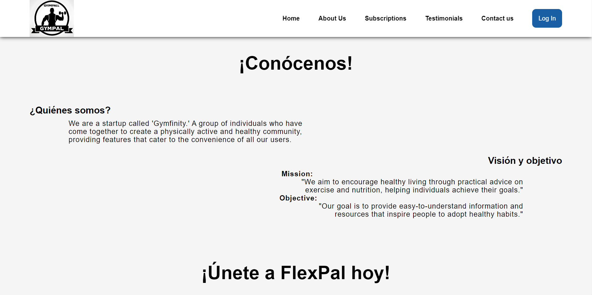
Imagen 78 - Deploy Landing Page
<br><br>

**Subscriptions**
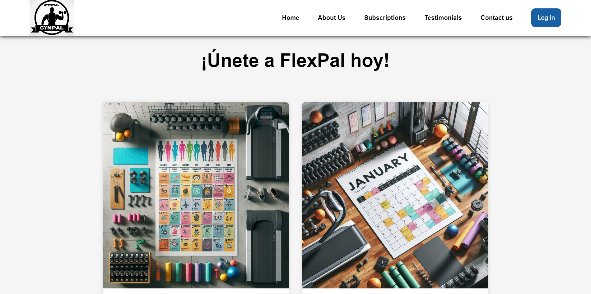
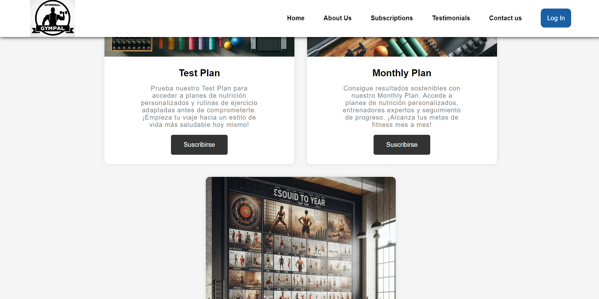
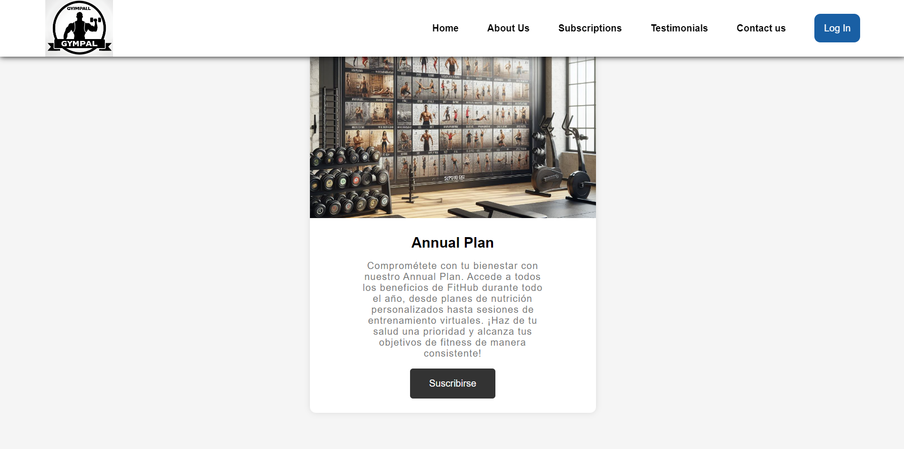
Imagen 79 - Deploy Landing Page
<br><br>

**Contact Us**
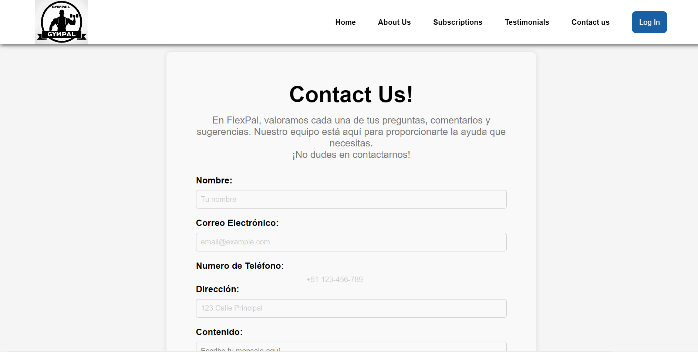
Imagen 80 - Deploy Landing Page
<br><br>


### 5.2.1.6. Services Documentation Evidence for Sprint Review.

En esta entrega, el equipo de desarrolladores de FlexPal ha completado con éxito la implementación y el lanzamiento de la página de la Landing Page. Esta página presenta diferentes secciones que brindan información detallada sobre nuestro producto.

### 5.2.1.7. Software Deployment Evidence for Sprint Review.
Para el despliegue de la Landing Page primero creamos el repositorio
indicado con ramas necesarias.
<br><br>
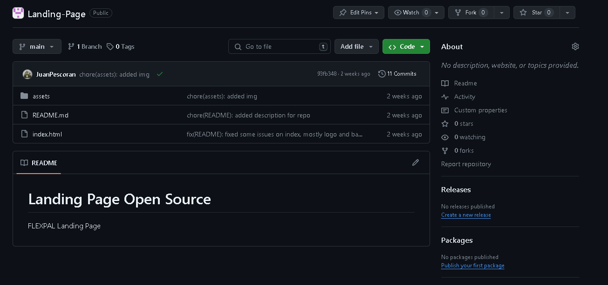
Imagen 81 - Deploy Landing Page
<br><br>
Para último, utilizando la herramienta de GitHub Pages completamos
la información que nos piden como la fuente y rama de donde
desplegaremos el trabajo, y luego de ellos nos brindará el link de
nuestro sitio web desplegado.
<br><br>
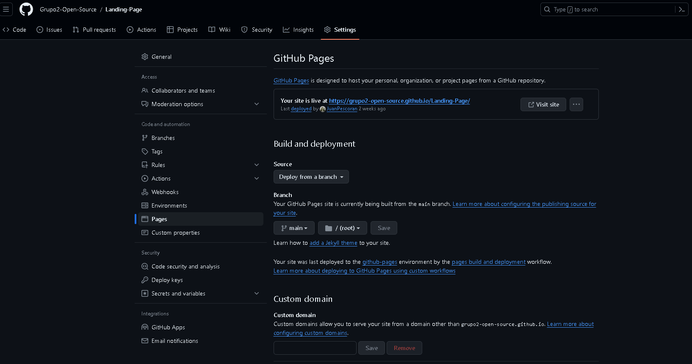
Imagen 82 - Deploy Landing Page
<br>

### 5.2.1.8. Team Collaboration Insights during Sprint.
Durante el sprint, cada miembro del equipo de Gimfinity participó de forma activa y constante en la realización de las tareas asignadas, demostrando progreso de manera individual:
<br><br>

<br>
Imagen 83 - Team Collaboration

### 5.2.2. Sprint 2
### 5.2.2.1. Sprint Planning 2
<table  style="text-align: center;">
    <tbody>
        <tr>
			<td colspan="1">Sprint #</td>
            <td colspan="1"> Sprint 2  </td>
		</tr>
        <tr>
			<td colspan="2">Sprint Planning Background </td>
		</tr>
        <tr>
			<td colspan="1">Date</td>
            <td colspan="1"> 2024-04-28 </td>
		</tr>
        <tr>
			<td colspan="1">Location</td>
            <td colspan="1">Discord (Reuniones Virtuales)</td>
		</tr>
        <tr>
			<td colspan="1">Prepared By</td>
            <td colspan="1">Juan Pescorán</td>
		</tr>
        <tr>
			<td colspan="1"> Attendees (to planning meeting)</td>
            <td colspan="1">- Juan Pescorán<br>
							- Angel Cancho<br>
							- Diego Pumahualcca<br>
							- Brenda Gamio<br></td>
		</tr>
         <tr>
			<td colspan="2">Sprint Goal & User Stories </td>
		</tr>
         <tr>
			<td colspan="1">Sprint 1 Goal </td>
            <td colspan="1">Realizar el front end de la web application de manera que sea atractiva y funcional</td>
		</tr>
        <tr>
			<td colspan="1">Sprint 1 Velocity </td>
            <td colspan="1">Se calcula mediante con el tiempo y story points?</td>
		</tr>
        <tr>
			<td colspan="1">Sum of Story Points </td>
            <td colspan="1">Se suma</td>
		</tr>
</tbody>
</table>

### 5.2.2.2. Sprint Backlog 2
<!--Hacer la tabla con todos los US, quién los hizo, etc-->
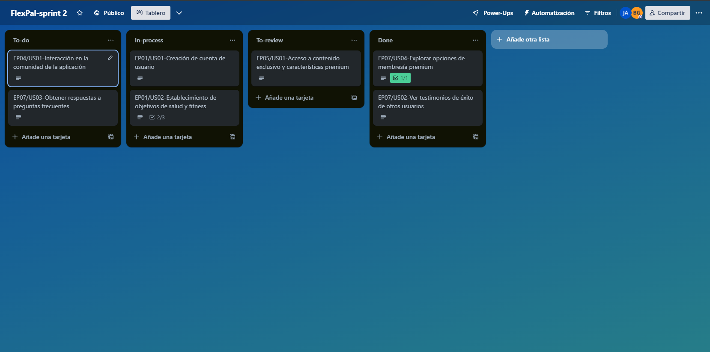


<table>
	<tbody>
		<tr>
			<td>Sprint #</td>
			<td colspan="7">Sprint 2</td>
		</tr>
		<tr>
			<td colspan="2">User Story</td>
			<td colspan="6">Work - Item / Task</td>
		</tr>
		<tr>
			<td>Id</td>
			<td>Title</td>
			<td>Id</td>
			<td>Title</td>
			<td>Description</td>
			<td>Estimation (Hours)</td>
			<td>Assigned To</td>
			<td>Status (To-do / In-Process / To-Review / Done)</td>
		</tr>
		<tr>
			<td></td>
			<td></td>
			<td>TSK008</td>
			<td>Remote environment creation for Front End App</td>
			<td>repositories and branch creations for Web Application in GitHub</td>
			<td>0</td>
			<td>Juan Pescoran</td>
			<td>Done</td>
		</tr>
		<tr>
			<td></td>
			<td></td>
			<td>TSK009</td>
			<td>Update Chapter01</td>
			<td>add the respective information resulting from the observations made in the review in chapter01</td>
			<td>5</td>
			<td>All team members</td>
			<td>Done</td>
		</tr>
		<tr>
			<td></td>
			<td></td>
			<td>TSK010</td>
			<td>Update Chapter02</td>
			<td>add the respective information resulting from the observations made in the review in chapter02</td>
			<td>1</td>
			<td>All team members</td>
			<td>Done</td>
		</tr>
		<tr>
			<td></td>
			<td></td>
			<td>TSK011</td>
			<td>Update Chapter03</td>
			<td>add the respective information resulting from the observations made in the review in chapter03</td>
			<td>2</td>
			<td>All team members</td>
			<td>Done</td>
		</tr>
		<tr>
			<td></td>
			<td></td>
			<td>TSK012</td>
			<td>Update Chapter04</td>
			<td>add the respective information resulting from the observations made in the review in chapter04</td>
			<td>6</td>
			<td>All team members</td>
			<td>Done</td>
		</tr>
		<tr>
			<td></td>
			<td></td>
			<td>TSK013</td>
			<td>Update Chapter05</td>
			<td>add the respective information resulting from the observations made in the review in chapter02</td>
			<td>4</td>
			<td>All team members</td>
			<td>Done</td>
		</tr>
    <tbody>
</table>

### 5.2.2.3. Development Evidence for Sprint Review

En la primera tabla
En la segunda tabla se ve el commit que realizó el cambio de lenguaje en la Landing Page.

Primero, se mostrarán los commits más importantes para el arreglo según las observaciones hechas al reporte:

| Repository              | Branch  | Commit ID                                | Commit Message                                                                         | Commit Message Body        | Commited on (Date) |
|-------------------------|---------|------------------------------------------|----------------------------------------------------------------------------------------|----------------------------|--------------------|
| JuanPescoran/Report     | main    | 5e72d8ec75120d189f891a115797b3ad572d3a9d | feat!: added content in README (v1)                                                    | -                          | 4/28/2024          |
| DiegoPumahualcca/Report | main    | b0b91c233673e221b32ab8c2e1f52f66f26b834e | feat: added Bibliografia and Anexos                                                 | -                          | 4/28/2024          |
| BGamio/Report           | main    | c9e861e800e338ffa641e7be366a1e990f9ce288 | chore: updated author's information and student outcomes                                            | -                          | 4/28/2024          |
| DiegoPumahualcca/Report | develop | e167eb7094d3c5186fa84ed4af77455aa07c13a4 | fix: chapter05                                               | -                          | 4/28/2024          |


### 5.2.2.4. Testing Suite Evidence for Sprint Review
Se ha omitido la sección de la aplicación web debido a que solo se ha desarrollado la Landing Page y la Front End Application. Se ofrecerá más información sobre la aplicación en una etapa posterior del desarrollo.
### 5.2.2.5. Execution Evidence for Sprint Review
Para la Front End:

https://master--flex-pal-frontendapp.netlify.app

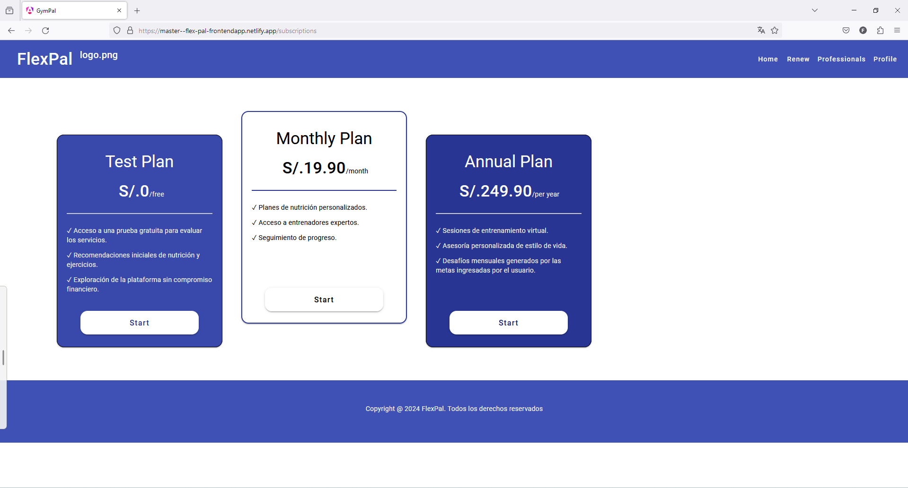

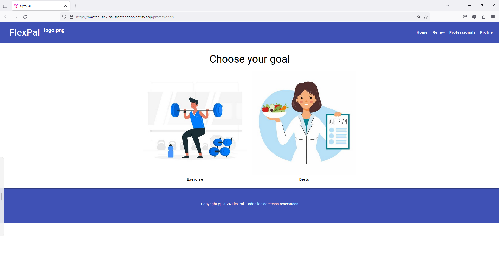

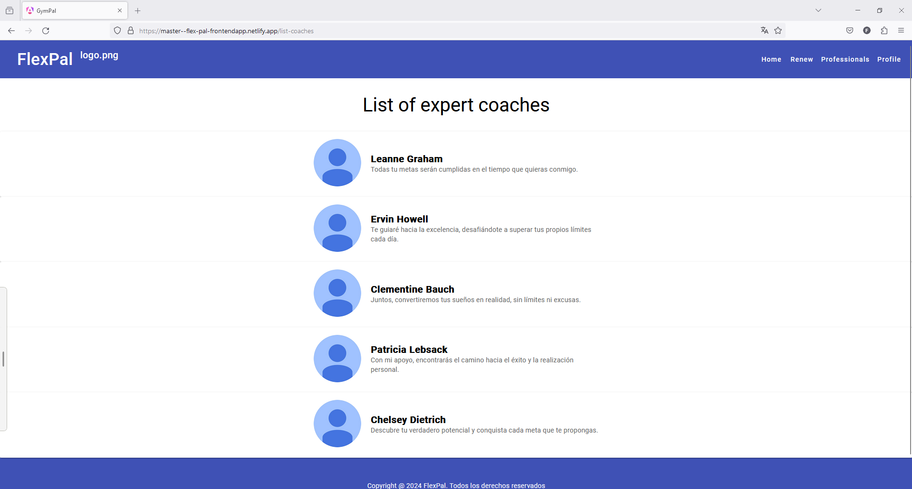

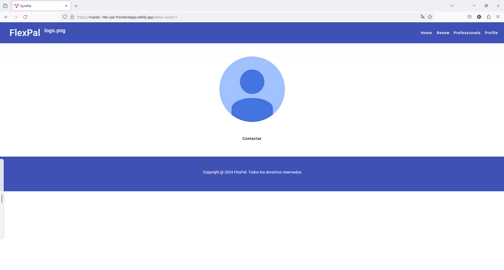

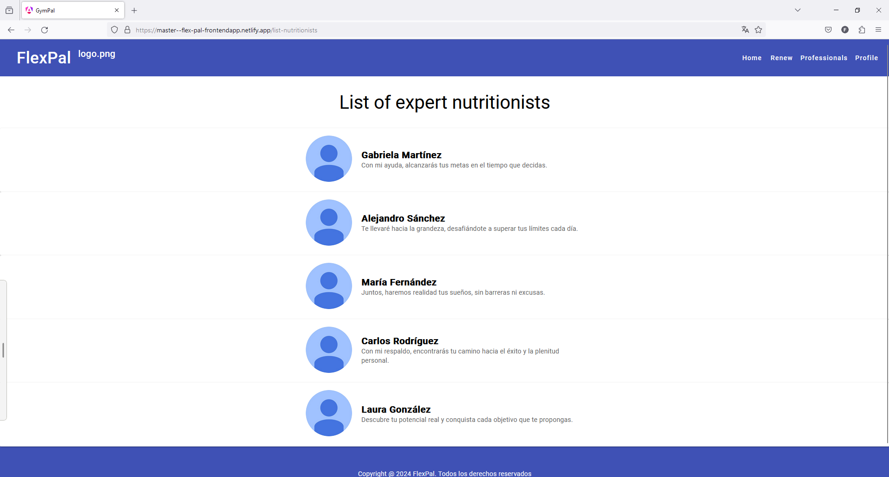

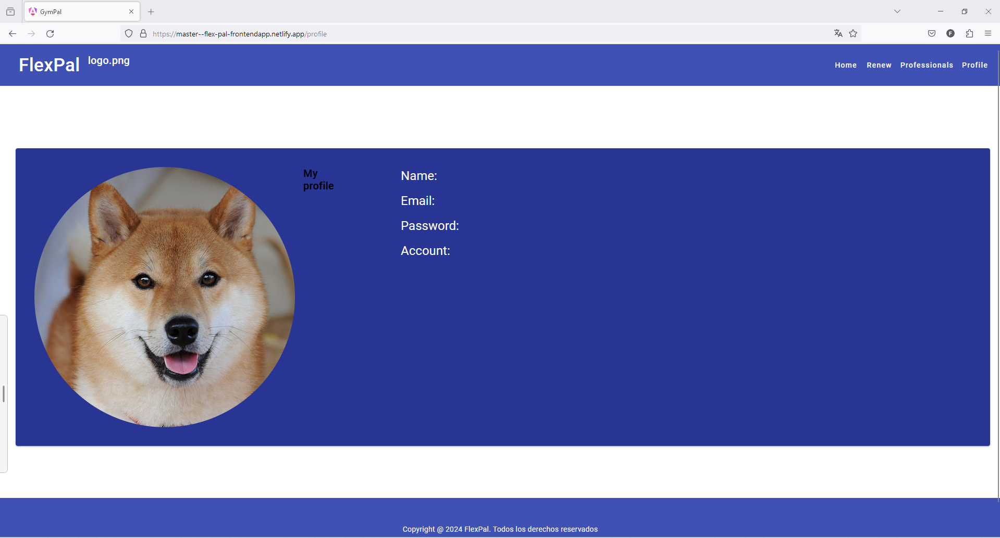

### 5.2.2.6. Services Documentation Evidence for Sprint Review

En este sprint, hemos podido desplegar una Web Application que consume json como data para mostrárselos al usuario, a continuación se muestra el código de la aplicación:

| Nombre del Endpoint        | Acciones Implementadas | Sintaxis de Llamada                                                   | Especificación de Parámetros                         | Ejemplo de Llamada                                                                                                                                                                                                                                                                                                             | Explicación del Response                                                                                                                      |
|----------------------------|------------------------|-----------------------------------------------------------------------|------------------------------------------------------|--------------------------------------------------------------------------------------------------------------------------------------------------------------------------------------------------------------------------------------------------------------------------------------------------------------------------------|-----------------------------------------------------------------------------------------------------------------------------------------------|
| member-api.service.json    | GET                    | (Not used)                                                            | Ya que es un GET, los parámetros que se piden son id | Language spanish to english index.html                                                                                                                                                                                                                                                                                         | En este caso, se está devolviendo el valor de todos los objetos "coaches" alojados en el json con el nombre 'member-api.service.json'.        |
| coach-api.service.json     | GET                    | ```axios.get("src/app/services/coach-api.service.json")```            | Ya que es un GET, los parámetros que se piden son id | ```fetchCoaches() {```<br>```axios.get("src/app/services/coach-api.service.json")```<br>```.then(response => {```<br>```console.log(response.data);```<br>```this.coaches = response.data.coaches;```<br>```})```<br>```.catch(error => {```<br>```console.error('Error fetching coaches:', error);```<br>```});```<br>```}``` | En este caso, se está devolviendo el valor de todos los objetos "coaches" alojados en el json con el  nombre 'coach-api.service.json'. |
| routines-api.service.json  | GET                    | ```fetch('src/app/routines/services/routines-api.service.json')```    | Ya que es un GET, los parámetros que se piden son id | ```fetch('src/app/routines/services/routines-api.service.json')```<br>```.then(response => response.json())```<br>```.then(data => {```<br>```this.routines = data;```<br>```});```                                                                                                                                            | En este caso, se está devolviendo el valor de todos los objetos "routines" alojados en el json con el nombre 'routines-api.service.json'. |
| food-item-api.service.json | GET                    | ```fetch('/src/app/food-item/services/food-item-api.service.json')``` | Ya que es un GET, los parámetros que se piden son id | ```fetch('/src/app/food-item/services/food-item-api.service.json')```<br>```.then(response => response.json())```<br>```.then(data => {```<br>```this.foodItems = data;```<br>```});```                                                                                                                                        | En este caso, se está devolviendo el valor de todos los objetos "food-item" alojados en el json con el nombre 'food-item-api.service.json'.   |


### Conclusiones
 - El proyecto tiene como objetivo satisfacer las necesidades de usuarios y profesionales del coaching en áreas relacionadas con el ejercicio y la alimentación. A través de una aplicación web, se proporcionará información sobre coaches confiables y se ofrecerán herramientas de gestión de planes personalizados y seguimiento continuo. Los usuarios buscarán comodidad y confianza al elegir servicios de coaching, mientras que los profesionales del coaching desean expandir su alcance y mejorar la comunicación con los clientes.
 - Para lograr el éxito en este proyecto, es esencial abordar el riesgo de errores funcionales mediante pruebas exhaustivas y mejoras continuas. Dada la competencia en el mercado de aplicaciones similares, la estrategia de adquisición de clientes se enfocará en las redes sociales, aprovechando modelos de suscripción y comisiones como posibles fuentes de ingresos adicionales. Esto garantizará una experiencia de usuario óptima y una mayor satisfacción tanto para los usuarios como para los profesionales del coaching.

### Anexos

Wireframes: https://www.figma.com/file/Pd1z1lfG0NMz9fbfCVBHdC/FlexPal?type=design&node-id=0-1&mode=design&t=UOoRWg9f5UHi0jw5-0
<br>

Prototype: https://www.figma.com/file/Pd1z1lfG0NMz9fbfCVBHdC/FlexPal?type=design&node-id=34-117&mode=design&t=UOoRWg9f5UHi0jw5-0
<br>

Mockups: https://www.figma.com/file/Pd1z1lfG0NMz9fbfCVBHdC/FlexPal?type=design&node-id=9-12&mode=design&t=UOoRWg9f5UHi0jw5-0
<br>

Style: https://www.figma.com/file/Pd1z1lfG0NMz9fbfCVBHdC/FlexPal?type=design&node-id=49-11&mode=design&t=UOoRWg9f5UHi0jw5-0
<br>

Wire flows: https://lucid.app/lucidchart/06e5a9b6-2a6f-4ca7-ac20-4729765c13d4/edit?invitationId=inv_65cf465b-fcaf-444a-b6bf-edd39644b707&page=0_0#
<br>

Repositorio Landing Page: https://github.com/Grupo2-Open-Source/Landing-Page
<br>

Landing Page desplegada: https://grupo2-open-source.github.io/Landing-Page/

