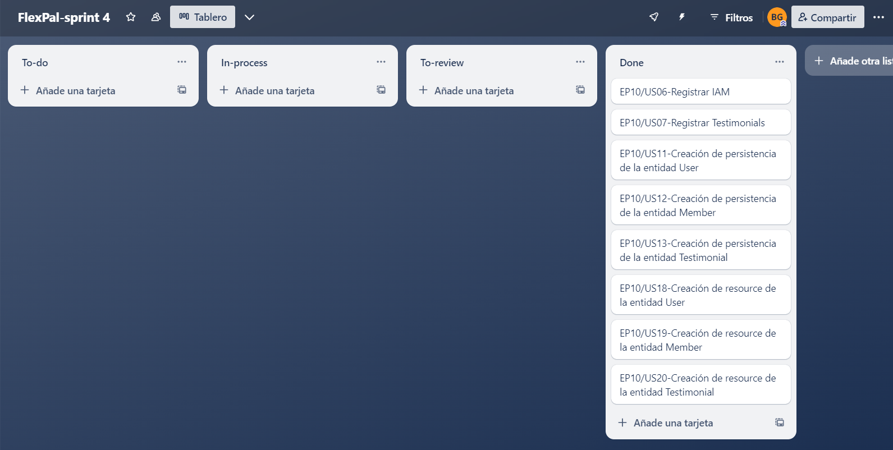

## 5.1. Software Configuration Management.
### 5.1.1. Software Development Environment Configuration.
Se muestra cada herramienta utilizada en el proyecto, para que el equipo pueda desarrollar cada punto del trabajo:
- UXPressia: Una plataforma colaborativa que facilita la creación de perfiles de usuarios y se integra con diversos mapas para evaluar sus prioridades.
- Figma: Una herramienta colaborativa que posibilita la elaboración de wireframes y maquetas.
- Vertabelo: Una plataforma colaborativa que permite la creación del diagrama de la base de datos.
- GitHub: Un repositorio colaborativo en la nube.
- WebStorm: Un entorno de desarrollo integrado (IDE) que utilizaremos para trabajar con JavaScript.
- HTML: Un lenguaje utilizado para la creación de páginas web.
- CSS: Una tecnología empleada para dar estilo a nuestras páginas web.

### 5.1.2. Source Code Management.
Operamos con dos ramas principales:
- Main: La rama principal donde presentamos nuestras publicaciones oficiales.
- Develop: Nuestra rama de desarrollo, donde probamos e integramos las funcionalidades trabajadas.
<br>Link del repo landing page: https://github.com/Grupo2-Open-Source/Landing-Page 
### 5.1.3. Source Code Style Guide & Conventions.
Para llevar a cabo nuestro proyecto, hemos empleado:
- Tecnologías: Incorporamos algunas de estas tecnologías en el desarrollo de nuestra aplicación, como HTML5 y CSS.<br><br>
- Herramientas: Utilizamos las tecnologías más populares y recomendadas para el desarrollo de nuestra aplicación, como GitHub, Figma y WebStorm.

### 5.1.4. Software Deployment Configuration.
A continuación, se detallará el proceso de implementación de nuestra landing page en la plataforma GitHub:

- Comenzamos creando un repositorio remoto en GitHub.
- Iniciamos el repositorio local utilizando el comando "git init".
- Luego, agregamos el repositorio remoto y transferimos los archivos a la nube de GitHub.
- Guardamos la configuración correspondiente.
- Finalmente, confirmamos el despliegue de nuestra página web una vez completado todo el procedimiento.

## 5.2. Landing Page, Services & Applications Implementation.
### 5.2.1. Sprint 1
### 5.2.1.1. 
El sprint planning es una reunión en la metodología ágil donde el equipo planifica las actividades del próximo sprint. Define qué trabajo se hará, cuánto tiempo tomará y quién será responsable. El objetivo es establecer un plan claro y alcanzable para el equipo, fomentando la colaboración y asegurando que todos estén alineados en cuanto a objetivos y prioridades.
<table  style="text-align: center;">
    <tbody>
        <tr>
			<td colspan="1">Sprint #</td>
            <td colspan="1"> Sprint 1  </td>
		</tr>
        <tr>
			<td colspan="2">Sprint Planning Background </td>
		</tr>
        <tr>
			<td colspan="1">Date</td>
            <td colspan="1"> 2024-04-10 </td>
		</tr>
        <tr>
			<td colspan="1">Location</td>
            <td colspan="1">Microoft Teams (Reuniones Virtuales)</td>
		</tr>
        <tr>
			<td colspan="1">Prepared By</td>
            <td colspan="1">Juan Pescorán</td>
		</tr>
        <tr>
			<td colspan="1"> Attendees (to planning meeting)</td>
            <td colspan="1">- Juan Pescorán<br>
							- Angel Cancho<br>
							- Diego Pumahualcca<br>
							- Brenda Gamio<br></td>
		</tr>
         <tr>
			<td colspan="2">Sprint Goal & User Stories </td>
		</tr>
         <tr>
			<td colspan="1">Sprint 1 Goal </td>
            <td colspan="1">Realizar la Landing Page</td>
		</tr>
        <tr>
			<td colspan="1">Sprint 1 Velocity </td>
            <td colspan="1">No se puede calcular ya que la realización de la Landing Page no tiene backlog items o story points</td>
		</tr>
        <tr>
			<td colspan="1">Sum of Story Points </td>
            <td colspan="1">No se puede calcular ya que la realización de la Landing Page no tiene story points</td>
		</tr>
</tbody>
</table>

### 5.2.1.2. Sprint Backlog 1.
Como solo se ha realizado la landing page y el reporte, no se puede mostrar esta información porque no presentan ningún tipo de User Sories ni Backlog Items.
### 5.2.1.3. Development Evidence for Sprint Review.
| Repository   | Branch                                      | Commit Id | Commit Message                   | Commit Message Body | Commited on (Date) |
| ------------ | ------------------------------------------- | --------- | -------------------------------- | ------------------- | ------------------ |
| Landing-Page | main      | fd5046d | Initial commit | Initial commit | 14/14/2024         |
| Landing-Page | main      | b6d9ebb | feat(index): added all sections and header      | feat(index):…. | 14/14/2024         |
| Landing-Page | main      | b4d5e12   | feat(styles): added styles for index.html  |feat(styles):…. | 14/14/2024         |
| Landing-Page | main      | 3d1ab4e    | feat(assets): added directory that contains images for index.html   |feat(assets):….  | 14/14/2024         |
| Landing-Page | main      | a925115   | feat(base): added base styles for all the landing page   |feat(base):….   | 14/14/2024         |
| Landing-Page | main      | 9563171 | chore(README): added description for repo | chore(README):…. | 14/14/2024         |
| Landing-Page | main      | 552edb8 | chore(assets): added logo and banner landing page | chore(assets):…. | 14/14/2024         |
| Landing-Page | main      | 424c17e | fix(README): fixed some issues on index, mostly logo and banner additions | fix(README):…. | 14/14/2024         |
| Landing-Page | main      | cc66f3c | fix(styles): fixed some issues with dimensions on logo and banner for index | fix(styles):…. | 14/14/2024         |
| Landing-Page | main      | 58daef1 | chore(assets): added img | chore(assets):…. | 14/14/2024         |
| Landing-Page | main      | 93fb348 | chore(assets): added img | chore(assets):…. | 14/14/2024         |


### 5.2.1.4. Testing Suite Evidence for Sprint Review.
Se ha omitido la sección de la aplicación web debido a que solo se ha desarrollado la Landing Page. Se ofrecerá más información sobre la aplicación en una etapa posterior del desarrollo.


### 5.2.1.5. Execution Evidence for Sprint Review.

En esta entrega, el equipo de desarrolladores pertenecientes a Gymfinity ha completado con éxito la implementación y el lanzamiento de la página de la Landing Page. Esta página presenta diferentes secciones que brindan información detallada sobre nuestro producto.
<br>

**Home**

Imagen 77 - Deploy Landing Page
<br><br>

**About Us**

Imagen 78 - Deploy Landing Page
<br><br>

**Subscriptions**


Imagen 79 - Deploy Landing Page
<br><br>

**Contact Us**

Imagen 80 - Deploy Landing Page
<br><br>


### 5.2.1.6. Services Documentation Evidence for Sprint Review.

En esta entrega, el equipo de desarrolladores de FlexPal ha completado con éxito la implementación y el lanzamiento de la página de la Landing Page. Esta página presenta diferentes secciones que brindan información detallada sobre nuestro producto.

### 5.2.1.7. Software Deployment Evidence for Sprint Review.
Para el despliegue de la Landing Page primero creamos el repositorio
indicado con ramas necesarias.
<br><br>

Imagen 81 - Deploy Landing Page
<br><br>
Para último, utilizando la herramienta de GitHub Pages completamos
la información que nos piden como la fuente y rama de donde
desplegaremos el trabajo, y luego de ellos nos brindará el link de
nuestro sitio web desplegado.
<br><br>

Imagen 82 - Deploy Landing Page
<br>

### 5.2.1.8. Team Collaboration Insights during Sprint.
Durante el sprint, cada miembro del equipo de Gimfinity participó de forma activa y constante en la realización de las tareas asignadas, demostrando progreso de manera individual:
<br><br>

<br>
Imagen 83 - Team Collaboration

### 5.2.2. Sprint 2
### 5.2.2.1. Sprint Planning 2
<table  style="text-align: center;">
    <tbody>
        <tr>
			<td colspan="1">Sprint #</td>
            <td colspan="1"> Sprint 2  </td>
		</tr>
        <tr>
			<td colspan="2">Sprint Planning Background </td>
		</tr>
        <tr>
			<td colspan="1">Date</td>
            <td colspan="1"> 2024-04-28 </td>
		</tr>
        <tr>
			<td colspan="1">Location</td>
            <td colspan="1">Discord (Reuniones Virtuales)</td>
		</tr>
        <tr>
			<td colspan="1">Prepared By</td>
            <td colspan="1">Juan Pescorán</td>
		</tr>
        <tr>
			<td colspan="1"> Attendees (to planning meeting)</td>
            <td colspan="1">- Juan Pescorán<br>
							- Angel Cancho<br>
							- Diego Pumahualcca<br>
							- Brenda Gamio<br></td>
		</tr>
         <tr>
			<td colspan="2">Sprint Goal & User Stories </td>
		</tr>
         <tr>
			<td colspan="1">Sprint 1 Goal </td>
            <td colspan="1">Realizar el front end de la web application de manera que sea atractiva y funcional</td>
		</tr>
        <tr>
			<td colspan="1">Sprint 1 Velocity </td>
            <td colspan="1">Se calcula mediante con el tiempo y story points?</td>
		</tr>
        <tr>
			<td colspan="1">Sum of Story Points </td>
            <td colspan="1">Se suma</td>
		</tr>
</tbody>
</table>

### 5.2.2.2. Sprint Backlog 2
<!--Hacer la tabla con todos los US, quién los hizo, etc-->


<table>
	<tbody>
		<tr>
			<td>Sprint #</td>
			<td colspan="7">Sprint 2</td>
		</tr>
		<tr>
			<td colspan="2">User Story</td>
			<td colspan="6">Work - Item / Task</td>
		</tr>
		<tr>
			<td>Id</td>
			<td>Title</td>
			<td>Id</td>
			<td>Title</td>
			<td>Description</td>
			<td>Estimation (Hours)</td>
			<td>Assigned To</td>
			<td>Status (To-do / In-Process / To-Review / Done)</td>
		</tr>
		<tr>
			<td></td>
			<td></td>
			<td>TSK008</td>
			<td>Remote environment creation for Front End App</td>
			<td>repositories and branch creations for Web Application in GitHub</td>
			<td>0</td>
			<td>Juan Pescoran</td>
			<td>Done</td>
		</tr>
		<tr>
			<td></td>
			<td></td>
			<td>TSK009</td>
			<td>Update Chapter01</td>
			<td>add the respective information resulting from the observations made in the review in chapter01</td>
			<td>5</td>
			<td>All team members</td>
			<td>Done</td>
		</tr>
		<tr>
			<td></td>
			<td></td>
			<td>TSK010</td>
			<td>Update Chapter02</td>
			<td>add the respective information resulting from the observations made in the review in chapter02</td>
			<td>1</td>
			<td>All team members</td>
			<td>Done</td>
		</tr>
		<tr>
			<td></td>
			<td></td>
			<td>TSK011</td>
			<td>Update Chapter03</td>
			<td>add the respective information resulting from the observations made in the review in chapter03</td>
			<td>2</td>
			<td>All team members</td>
			<td>Done</td>
		</tr>
		<tr>
			<td></td>
			<td></td>
			<td>TSK012</td>
			<td>Update Chapter04</td>
			<td>add the respective information resulting from the observations made in the review in chapter04</td>
			<td>6</td>
			<td>All team members</td>
			<td>Done</td>
		</tr>
		<tr>
			<td></td>
			<td></td>
			<td>TSK013</td>
			<td>Update Chapter05</td>
			<td>add the respective information resulting from the observations made in the review in chapter02</td>
			<td>4</td>
			<td>All team members</td>
			<td>Done</td>
		</tr>
    <tbody>
</table>

### 5.2.2.3. Development Evidence for Sprint Review

En la primera tabla
En la segunda tabla se ve el commit que realizó el cambio de lenguaje en la Landing Page.

Primero, se mostrarán los commits más importantes para el arreglo según las observaciones hechas al reporte:

| Repository              | Branch  | Commit ID                                | Commit Message                                                                         | Commit Message Body        | Commited on (Date) |
|-------------------------|---------|------------------------------------------|----------------------------------------------------------------------------------------|----------------------------|--------------------|
| JuanPescoran/Report     | main    | 5e72d8ec75120d189f891a115797b3ad572d3a9d | feat!: added content in README (v1)                                                    | -                          | 4/28/2024          |
| DiegoPumahualcca/Report | main    | b0b91c233673e221b32ab8c2e1f52f66f26b834e | feat: added Bibliografia and Anexos                                                 | -                          | 4/28/2024          |
| BGamio/Report           | main    | c9e861e800e338ffa641e7be366a1e990f9ce288 | chore: updated author's information and student outcomes                                            | -                          | 4/28/2024          |
| DiegoPumahualcca/Report | develop | e167eb7094d3c5186fa84ed4af77455aa07c13a4 | fix: chapter05                                               | -                          | 4/28/2024          |


### 5.2.2.4. Testing Suite Evidence for Sprint Review
Se ha omitido la sección de la aplicación web debido a que solo se ha desarrollado la Landing Page y la Front End Application. Se ofrecerá más información sobre la aplicación en una etapa posterior del desarrollo.
### 5.2.2.5. Execution Evidence for Sprint Review
Para la Front End:

https://master--flex-pal-frontendapp.netlify.app


### 5.2.2.6. Services Documentation Evidence for Sprint Review

En este sprint, hemos podido desplegar una Web Application que consume json como data para mostrárselos al usuario, a continuación se muestra el código de la aplicación:

| Nombre del Endpoint        | Acciones Implementadas | Sintaxis de Llamada                                                   | Especificación de Parámetros                         | Ejemplo de Llamada                                                                                                                                                                                                                                                                                                             | Explicación del Response                                                                                                                      |
|----------------------------|------------------------|-----------------------------------------------------------------------|------------------------------------------------------|--------------------------------------------------------------------------------------------------------------------------------------------------------------------------------------------------------------------------------------------------------------------------------------------------------------------------------|-----------------------------------------------------------------------------------------------------------------------------------------------|
| member-api.service.json    | GET                    | (Not used)                                                            | Ya que es un GET, los parámetros que se piden son id | Language spanish to english index.html                                                                                                                                                                                                                                                                                         | En este caso, se está devolviendo el valor de todos los objetos "coaches" alojados en el json con el nombre 'member-api.service.json'.        |
| coach-api.service.json     | GET                    | ```axios.get("src/app/services/coach-api.service.json")```            | Ya que es un GET, los parámetros que se piden son id | ```fetchCoaches() {```<br>```axios.get("src/app/services/coach-api.service.json")```<br>```.then(response => {```<br>```console.log(response.data);```<br>```this.coaches = response.data.coaches;```<br>```})```<br>```.catch(error => {```<br>```console.error('Error fetching coaches:', error);```<br>```});```<br>```}``` | En este caso, se está devolviendo el valor de todos los objetos "coaches" alojados en el json con el  nombre 'coach-api.service.json'. |
| routines-api.service.json  | GET                    | ```fetch('src/app/routines/services/routines-api.service.json')```    | Ya que es un GET, los parámetros que se piden son id | ```fetch('src/app/routines/services/routines-api.service.json')```<br>```.then(response => response.json())```<br>```.then(data => {```<br>```this.routines = data;```<br>```});```                                                                                                                                            | En este caso, se está devolviendo el valor de todos los objetos "routines" alojados en el json con el nombre 'routines-api.service.json'. |
| food-item-api.service.json | GET                    | ```fetch('/src/app/food-item/services/food-item-api.service.json')``` | Ya que es un GET, los parámetros que se piden son id | ```fetch('/src/app/food-item/services/food-item-api.service.json')```<br>```.then(response => response.json())```<br>```.then(data => {```<br>```this.foodItems = data;```<br>```});```                                                                                                                                        | En este caso, se está devolviendo el valor de todos los objetos "food-item" alojados en el json con el nombre 'food-item-api.service.json'.   |

### 5.2.3. Sprint 3
En esta sección se registra y explica el avance en términos de producto y trabajo colaborativo para el Sprint 3. Incluye como secciones internas: Sprint Planning 3, Sprint Backlog 3, Development Evidence for Sprint Review, Execution Evidence for Sprint Review, Services Documentation Evidence for Sprint Review, junto con Team Collaboration Insights during Sprint

#### 5.2.3.1. Sprint Planning 3.

<table  style="text-align: center;">
    <tbody>
        <tr>
			<td colspan="1">Sprint #</td>
            <td colspan="1"> Sprint 3 </td>
		</tr>
        <tr>
			<td colspan="2">Sprint Planning Background </td>
		</tr>
        <tr>
			<td colspan="1">Date</td>
            <td colspan="1"> 2024-06-01 </td>
		</tr>
        <tr>
			<td colspan="1">Time</td>
            <td colspan="1"> 10:00 PM </td>
		</tr>
        <tr>
			<td colspan="1">Location</td>
            <td colspan="1">Discord (Reunion virtual)</td>
		</tr>
        <tr>
			<td colspan="1">Prepared By</td>
            <td colspan="1">Pescoran Angulo, Juan Fabritzzio</td>
		</tr>
        <tr>
			<td colspan="1"> Attendees (to planning meeting)</td>
            <td colspan="1">- Juan Pescorán<br>
							- Angel Cancho<br>
							- Diego Pumahualcca<br>
							- Brenda Gamio<br> </td>
		</tr>
         <tr>
			<td colspan="1">Sprint 3 – 1 Review Summary </td>
            <td colspan="1">Se alcanzaron los objetivos: Funcionamiento y despliegue de nuestra Web API, </td>
		</tr>
         <tr>
			<td colspan="1">Sprint 3 – 1 Retrospective Summary </td>
            <td colspan="1">Comparado a otros sprints, este es el más trabajoso comparado a los demás, pues se necesitaba la parte de Backend, teniendo terminado el report, el Front End, y la landing page.</td>
		</tr>
         <tr>
			<td colspan="2">Sprint Goal & User Stories </td>
		</tr>
         <tr>
			<td colspan="1">Sprint 3 Goal</td>
            <td colspan="1">Para este sprint se requiere el cumplimiento de los siguientes objetivos: Mejoramiento de la Front End, añadiendo la implementación de los mockups pertenecientes al reporte y el cumplimiento total dela creación del backend.</td>
		</tr>
        <tr>
			<td colspan="1">Sprint 3 Velocity </td>
            <td colspan="1">Para este sprint se han elegido 9 User Stories que tienen 5 Story points 8 de ellas y una de 3 Story points.</td>
		</tr>
        <tr>
			<td colspan="1">Sum of Story Points </td>
            <td colspan="1">43</td>
		</tr>
</tbody>
</table>

#### 5.2.3.2. Sprint Backlog 3.

En este tercer sprint el equipo se ha enfocado en el mejoramiento de la Landing Page, el reporte, Front End Application y el Back End. A continuación, se presenta el backlog de tareas para el Sprint 3:
[Link para ingresar al board del tecer Sprint](https://trello.com/b/5bsUVC3d/flexpal-sprint-3)


<table>
	<tbody>
		<tr>
			<td>Sprint #</td>
			<td colspan="7">Sprint 3</td>
		</tr>
		<tr>
			<td colspan="2">User Story</td>
			<td colspan="6">Work - Item / Task</td>
		</tr>
		<tr>
			<td>Id</td>
			<td>Title</td>
			<td>Description</td>
			<td>Estimation (Hours)</td>
			<td>Assigned To</td>
			<td>Status (To-do / In-Process / To-Review / Done)</td>
		</tr>
		<tr>
			<td>EP10/US01</td>
			<td>Acceder a EndPoints</td>
			<td>Como desarrollador, quiero tener acceso a los endpoints de la aplicación para poder interactuar con ella.</td>
			<td>6</td>
			<td>All team members</td>
			<td>In-Process</td>
		</tr>
		<tr>
			<td>EP10/US02</td>
			<td>Registrar Subscripciones</td>
			<td>Como developer, quiero contar con un endpoint para poder registrar las subscripciones que tienen los usuarios.</td>
			<td>2</td>
			<td>Brenda Gamio</td>
			<td>Done</td>
		</tr>
		<tr>
			<td>EP10/US04</td>
			<td>Registrar Usuarios</td>
			<td>Como developer, quiero contar con un endpoint para poder registrar a los Usuarios.</td>
			<td>2</td>
			<td>Angel Cancho</td>
			<td>Done</td>
		</tr>
		<tr>
			<td>EP10/US05</td>
			<td>Registrar Rutinas</td>
			<td>Como developer, quiero contar con un endpoint para poder registrar las rutinas.</td>
			<td>2</td>
			<td>Juan Pescorán</td>
			<td>Done</td>
		</tr>
		<tr>
			<td>EP10/US07</td>
			<td>Creación de persistencia de la entidad Subscription</td>
			<td>Como developer, quiero realizar la persistencia de la información para la entidad Subscription.</td>
			<td>2</td>
			<td>Brenda Gamio</td>
			<td>Done</td>
		</tr>
		<tr>
			<td>EP10/US08</td>
			<td>Creación de persistencia de la entidad Usuarios</td>
			<td>Como developer, quiero implementar la persistencia de la información de la entidad User para asegurar que los datos de los usuarios se almacenen de manera segura y estén disponibles cuando sea necesario.</td>
			<td>2</td>
			<td>Angel Cancho</td>
			<td>Done</td>
		</tr>
		<tr>
			<td>EP10/US09</td>
			<td> Creación de persistencia de la entidad Rutina</td>
			<td>Como developer quiero hacer persistir la información de la entidad Rutina para tener registrado.</td>
			<td>2</td>
			<td>Juan Pescorán</td>
			<td>Done</td>
		</tr>
		<tr>
			<td>EP10/US11</td>
			<td>Creación de resource de la entidad Subscription</td>
			<td>Como developer quiero devolver un resource de la información de la entidad Subscription para realizar consultas.	</td>
			<td>2</td>
			<td>Brenda Gamio</td>
			<td>Done</td>
		</tr>
		<tr>
			<td>EP10/US12</td>
			<td>Creación de resource de la entidad Usuarios</td>
			<td>Como developer quiero devolver un resource de la información de la entidad User para realizar consultas.</td>
			<td>2</td>
			<td>Angel Cancho</td>
			<td>Done</td>
		</tr>
		<tr>
			<td>EP10/US13</td>
			<td>Creación de resource de la entidad Rutina</td>
			<td>CoCreación de resource de la entidad Rutina | Como developer quiero devolver un resource de la información de la entidad Rutina para realizar consultas.</td>
			<td>2</td>
			<td>Juan Pescorán</td>
			<td>Done</td>
		</tr>        
    <tbody>
</table>

#### 5.2.3.3.Development Evidence for Sprint Review.

Se mostrarán los commits más importantes para la implementación de la API Platform Application:

| Repository                      | Branch        | Commit ID                                | Commit Message                                                             | Commit Message Body | Commited on (Date) |
|---------------------------------|---------------|------------------------------------------|----------------------------------------------------------------------------|---------------------|--------------------|
| JuanPescoran/FlexxPalPlatform.API | master          | 1912ee5ae41b9545859d10d38e3808ea69fafbed | chore: Initial Commit                                                     | -                   | 5/29/2024          |
| notfakeangel/FlexxPalPlatform.API | profiles       | 1acd21123aa9fc2bc46a1f5cad80e4d89d663fc7 | feat: added Profile aggregate with embedded value objects      | -                   | 5/31/2024           |
| JuanPescoran/FlexxPalPlatform.API       | routines    | af95ef607643bd25cb453b7dfa1f5a3b57ec46c5 | feat(counseling): added member class in the domain layer   | -                   | 6/5/2024           |
| BGamio/FlexxPalPlatform.API | subscriptions           | 7a73a0e455d18ce44ead51802b1facfb00377bd7 | feat: Added subscription bounded context | -                   | 6/5/2024           |


#### 5.2.3.4.Testing Suite Evidence for Sprint Review.
Se ha omitido esta sección, puesto que aún no se dispone con el conocimiento para realizar pruebas de tests automatizados, que están planeadas en realizarse en el siguiente sprint.

#### 5.2.3.5.Execution Evidence for Sprint Review.
En esta entrega, el equipo de desarrolladores de FlexPal ha completado con éxito la implementación de la página del Back end Application. Esta página presenta diferentes secciones que brindan información detallada sobre nuestro producto.


Por parte de la base de datos:


#### 5.2.3.6.Services Documentation Evidence for Sprint Review.
En este sprint, hemos podido desplegar una Web Application que consume json como data para mostrárselos al usuario, a continuación se muestra el código de la aplicación:

| Nombre del Endpoint | Acciones Implementadas | Sintaxis de Llamada                                                                                                                                                                                        | Especificación de Parámetros                                                                                                                                                                                                                                                    | Ejemplo de Llamada | Explicación del Response                                                                                                                 |
|---------------------|------------------------|------------------------------------------------------------------------------------------------------------------------------------------------------------------------------------------------------------|---------------------------------------------------------------------------------------------------------------------------------------------------------------------------------------------------------------------------------------------------------------------------------|--------------------|------------------------------------------------------------------------------------------------------------------------------------------|
| Coach               | POST, GET              | POST: ```/api/v1/coaches``` GET: ```/api/v1/coaches, /api/v1/coaches/{coachId} ```                                                                                                                                          | GET: ```"id": int```, POST: ```"speciality": "string", "lengthOfService": "int", "firstName": "string", "lastName": "string", "email": "string", "image": "string"```                                                                                                                                      | -                  | En este caso, se está devolviendo el valor de todos los objetos "coaches" alojados en el json con el nombre 'api/v1/coach'.              |
| CustomizedPlan         | POST, GET              | POST: ```/api/v1/customized-plans```, ```/api/v1/customized-plans{customizedPlanId}/routine-items```, ```/api/v1/customized-plans{customizedPlanId}/nutritional-meals```  GET: ```/api/v1/customized-plans, /api/v1/customized-plans/{customizedPlanId}``` | GET: ```"id": int```, POST: ```"objective": "string", "levelOfExperience": "string"```, ```"firstName": "string", "lastName": "string", "email": "string", "image": "string"```                                                                                    | -                  | En este caso, se está devolviendo el valor de todos los objetos "customized-plan" alojados en el json con el  nombre 'api/v1/customized-plan'. |
| Profiles            | POST, GET         | POST: ```/api/v1/profiles```, GET: ```/api/v1/profiles```, ```/api/v1/profiles/{profileId}```                                                                     | GET: ```"id": int```, POST: ```"firstName": "string", "lastName": "string", "email": "string", "image": "string"``` | -                  | En este caso, se está devolviendo el valor de todos los objetos "perfiles" alojados en el json con el nombre 'api/v1/profiles'.          |
| Subscriptions               | POST, GET              | POST: ```/api/v1/subscription```, GET: ```/api/v1/subscriptions```               | GET: ```"id": int```, POST: ```"pirce": "float", "services": "string"```            | -                  | En este caso, se está devolviendo el valor de todos los objetos "subscription" alojados en el json con el nombre 'api/v1/subscription'.                 |

#### 5.2.3.7.Software Deployment Evidence for Sprint Review.

Para el despliegue de nuestra Front End App, se usó: 


Para el despliegue de nuestra aPI se usó: [SmarterAsp](https://www.smarterasp.net/)


#### 5.2.3.8.Team Collaboration Insights during Sprint.
A continuación todos los analíticos que nos proporciona Github, en su apartado de Insights, sobre la colaboración del equipo durante el Sprint 3:


### 5.2.4. Sprint 4
En esta sección se registra y explica el avance en términos de producto y trabajo colaborativo para el Sprint 4. Incluye como secciones internas: Sprint Planning 4, Sprint Backlog 4, Development Evidence for Sprint Review, Execution Evidence for Sprint Review, Services Documentation Evidence for Sprint Review, junto con Team Collaboration Insights during Sprint

#### 5.2.4.1. Sprint Planning 3.

<table  style="text-align: center;">
    <tbody>
        <tr>
			<td colspan="1">Sprint #</td>
            <td colspan="1"> Sprint 4 </td>
		</tr>
        <tr>
			<td colspan="2">Sprint Planning Background </td>
		</tr>
        <tr>
			<td colspan="1">Date</td>
            <td colspan="1"> 2024-06-12 </td>
		</tr>
        <tr>
			<td colspan="1">Time</td>
            <td colspan="1"> 07:00 PM </td>
		</tr>
        <tr>
			<td colspan="1">Location</td>
            <td colspan="1">Discord (Reunion virtual)</td>
		</tr>
        <tr>
			<td colspan="1">Prepared By</td>
            <td colspan="1">Pescoran Angulo, Juan Fabritzzio</td>
		</tr>
        <tr>
			<td colspan="1"> Attendees (to planning meeting)</td>
            <td colspan="1">- Juan Pescorán<br>
							- Angel Cancho<br>
							- Brenda Gamio<br> </td>
		</tr>
         <tr>
			<td colspan="1">Sprint 4 – 1 Review Summary </td>
            <td colspan="1">Se alcanzaron los objetivos: Agregar otros endpoints y el despliegue de nuestra Web API, y que se conecte con nuestro aplicativo web. </td>
		</tr>
         <tr>
			<td colspan="1">Sprint 4 – 2 Retrospective Summary </td>
            <td colspan="1">Comparado a otros sprints, este es el más complicado comparado a los demás, pues se necesitaba la parte de Backend, teniendo terminado el report, el Front End, y la landing page.</td>
		</tr>
         <tr>
			<td colspan="2">Sprint Goal & User Stories </td>
		</tr>
         <tr>
			<td colspan="1">Sprint 4 Goal</td>
            <td colspan="1">Para este sprint se requiere el cumplimiento de los siguientes objetivos: Mejoramiento de la Front End, añadiendo la implementación de los mockups pertenecientes al reporte y el cumplimiento total de la creación del backend.</td>
		</tr>
        <tr>
			<td colspan="1">Sprint 4 Velocity </td>
            <td colspan="1">Para este sprint se han elegido 8 User Stories que tienen 5 Story points.</td>
		</tr>
        <tr>
			<td colspan="1">Sum of Story Points </td>
            <td colspan="1">40</td>
		</tr>
</tbody>
</table>

#### 5.2.4.2. Sprint Backlog 4.

En este tercer sprint el equipo se ha enfocado en el mejoramiento de la Landing Page, el reporte, Front End Application y el Back End. A continuación, se presenta el backlog de tareas para el Sprint 3:
[Link para ingresar al board del tecer Sprint](https://trello.com/invite/b/fGqyDLCI/ATTI3be395ce15826f939c4c77b0c9e6c76a448824CB/flexpal-sprint-4)



<table>
	<tbody>
		<tr>
			<td>Sprint #</td>
			<td colspan="7">Sprint 3</td>
		</tr>
		<tr>
			<td colspan="2">User Story</td>
			<td colspan="6">Work - Item / Task</td>
		</tr>
		<tr>
			<td>Id</td>
			<td>Title</td>
			<td>Description</td>
			<td>Estimation (Hours)</td>
			<td>Assigned To</td>
			<td>Status (To-do / In-Process / To-Review / Done)</td>
		</tr>
		<tr>
			<td>EP10/US01</td>
			<td>Acceder a EndPoints</td>
			<td>Como desarrollador, quiero tener acceso a los endpoints de la aplicación para poder interactuar con ella.</td>
			<td>6</td>
			<td>All team members</td>
			<td>In-Process</td>
		</tr>
		<tr>
			<td>EP10/US02</td>
			<td>Registrar Subscripciones</td>
			<td>Como developer, quiero contar con un endpoint para poder registrar las subscripciones que tienen los usuarios.</td>
			<td>2</td>
			<td>Brenda Gamio</td>
			<td>Done</td>
		</tr>
		<tr>
			<td>EP10/US04</td>
			<td>Registrar Usuarios</td>
			<td>Como developer, quiero contar con un endpoint para poder registrar a los Usuarios.</td>
			<td>2</td>
			<td>Angel Cancho</td>
			<td>Done</td>
		</tr>
		<tr>
			<td>EP10/US05</td>
			<td>Registrar Rutinas</td>
			<td>Como developer, quiero contar con un endpoint para poder registrar las rutinas.</td>
			<td>2</td>
			<td>Juan Pescorán</td>
			<td>Done</td>
		</tr>
		<tr>
			<td>EP10/US07</td>
			<td>Creación de persistencia de la entidad Subscription</td>
			<td>Como developer, quiero realizar la persistencia de la información para la entidad Subscription.</td>
			<td>2</td>
			<td>Brenda Gamio</td>
			<td>Done</td>
		</tr>
		<tr>
			<td>EP10/US08</td>
			<td>Creación de persistencia de la entidad Usuarios</td>
			<td>Como developer, quiero implementar la persistencia de la información de la entidad User para asegurar que los datos de los usuarios se almacenen de manera segura y estén disponibles cuando sea necesario.</td>
			<td>2</td>
			<td>Angel Cancho</td>
			<td>Done</td>
		</tr>
		<tr>
			<td>EP10/US09</td>
			<td> Creación de persistencia de la entidad Rutina</td>
			<td>Como developer quiero hacer persistir la información de la entidad Rutina para tener registrado.</td>
			<td>2</td>
			<td>Juan Pescorán</td>
			<td>Done</td>
		</tr>
		<tr>
			<td>EP10/US11</td>
			<td>Creación de resource de la entidad Subscription</td>
			<td>Como developer quiero devolver un resource de la información de la entidad Subscription para realizar consultas.	</td>
			<td>2</td>
			<td>Brenda Gamio</td>
			<td>Done</td>
		</tr>
		<tr>
			<td>EP10/US12</td>
			<td>Creación de resource de la entidad Usuarios</td>
			<td>Como developer quiero devolver un resource de la información de la entidad User para realizar consultas.</td>
			<td>2</td>
			<td>Angel Cancho</td>
			<td>Done</td>
		</tr>
		<tr>
			<td>EP10/US13</td>
			<td>Creación de resource de la entidad Rutina</td>
			<td>CoCreación de resource de la entidad Rutina | Como developer quiero devolver un resource de la información de la entidad Rutina para realizar consultas.</td>
			<td>2</td>
			<td>Juan Pescorán</td>
			<td>Done</td>
		</tr>        
    <tbody>
</table>

#### 5.2.4.3.Development Evidence for Sprint Review.

Se mostrarán los commits más importantes para la implementación de la API Platform Application:

| Repository                      | Branch        | Commit ID                                | Commit Message                                                             | Commit Message Body | Commited on (Date) |
|---------------------------------|---------------|------------------------------------------|----------------------------------------------------------------------------|---------------------|--------------------|
| JuanPescoran/FlexxPalPlatform.API | master          | 1912ee5ae41b9545859d10d38e3808ea69fafbed | chore: Initial Commit                                                     | -                   | 5/29/2024          |
| notfakeangel/FlexxPalPlatform.API | profiles       | 1acd21123aa9fc2bc46a1f5cad80e4d89d663fc7 | feat: added Profile aggregate with embedded value objects      | -                   | 5/31/2024           |
| JuanPescoran/FlexxPalPlatform.API       | routines    | af95ef607643bd25cb453b7dfa1f5a3b57ec46c5 | feat(counseling): added member class in the domain layer   | -                   | 6/5/2024           |
| BGamio/FlexxPalPlatform.API | subscriptions           | 7a73a0e455d18ce44ead51802b1facfb00377bd7 | feat: Added subscription bounded context | -                   | 6/5/2024           |


#### 5.2.4.4.Testing Suite Evidence for Sprint Review.
Se ha omitido esta sección, puesto que aún no se dispone con el conocimiento para realizar pruebas de tests automatizados, que están planeadas en realizarse en el siguiente sprint.

#### 5.2.4.5.Execution Evidence for Sprint Review.
En esta entrega, el equipo de desarrolladores de FlexPal ha completado con éxito la implementación de la página del Back end Application. Esta página presenta diferentes secciones que brindan información detallada sobre nuestro producto.


Por parte de la base de datos:


#### 5.2.4.6.Services Documentation Evidence for Sprint Review.
En este sprint, hemos podido desplegar una Web Application que consume json como data para mostrárselos al usuario, a continuación se muestra el código de la aplicación:

| Nombre del Endpoint | Acciones Implementadas | Sintaxis de Llamada                                                                                                                                                                                        | Especificación de Parámetros                                                                                                                                                                                                                                                    | Ejemplo de Llamada | Explicación del Response                                                                                                                 |
|---------------------|------------------------|------------------------------------------------------------------------------------------------------------------------------------------------------------------------------------------------------------|---------------------------------------------------------------------------------------------------------------------------------------------------------------------------------------------------------------------------------------------------------------------------------|--------------------|------------------------------------------------------------------------------------------------------------------------------------------|
| Coach               | POST, GET              | POST: ```/api/v1/coaches``` GET: ```/api/v1/coaches, /api/v1/coaches/{coachId} ```                                                                                                                                          | GET: ```"id": int```, POST: ```"speciality": "string", "lengthOfService": "int", "firstName": "string", "lastName": "string", "email": "string", "image": "string"```                                                                                                                                      | -                  | En este caso, se está devolviendo el valor de todos los objetos "coaches" alojados en el json con el nombre 'api/v1/coach'.              |
| CustomizedPlan         | POST, GET              | POST: ```/api/v1/customized-plans```, ```/api/v1/customized-plans{customizedPlanId}/routine-items```, ```/api/v1/customized-plans{customizedPlanId}/nutritional-meals```  GET: ```/api/v1/customized-plans, /api/v1/customized-plans/{customizedPlanId}``` | GET: ```"id": int```, POST: ```"objective": "string", "levelOfExperience": "string"```, ```"firstName": "string", "lastName": "string", "email": "string", "image": "string"```                                                                                    | -                  | En este caso, se está devolviendo el valor de todos los objetos "customized-plan" alojados en el json con el  nombre 'api/v1/customized-plan'. |
| Profiles            | POST, GET         | POST: ```/api/v1/profiles```, GET: ```/api/v1/profiles```, ```/api/v1/profiles/{profileId}```                                                                     | GET: ```"id": int```, POST: ```"firstName": "string", "lastName": "string", "email": "string", "image": "string"``` | -                  | En este caso, se está devolviendo el valor de todos los objetos "perfiles" alojados en el json con el nombre 'api/v1/profiles'.          |
| Subscriptions               | POST, GET              | POST: ```/api/v1/subscription```, GET: ```/api/v1/subscriptions```               | GET: ```"id": int```, POST: ```"pirce": "float", "services": "string"```            | -                  | En este caso, se está devolviendo el valor de todos los objetos "subscription" alojados en el json con el nombre 'api/v1/subscription'.                 |

#### 5.2.4.7.Software Deployment Evidence for Sprint Review.

Para el despliegue de nuestra Front End App, se usó: 


Para el despliegue de nuestra aPI se usó: [SmarterAsp](https://www.smarterasp.net/)


#### 5.2.4.8.Team Collaboration Insights during Sprint.
A continuación todos los analíticos que nos proporciona Github, en su apartado de Insights, sobre la colaboración del equipo durante el Sprint 3:


## 5.3. Validation Interviews

### 5.3.1. Diseño de Entrevistas

Para la validación de nuestro proyecto, hemos diseñado una serie de entrevistas con el fin de obtener feedback de nuestros usuarios. A continuación se presentan las preguntas que se realizarán en las entrevistas:

Preguntas generales:
- ¿Cuál es tu nombre?
- ¿Qué edad tienes?
- ¿Dónde vives actualmente?
- ¿A qué te dedicas?


- **Individuos interesados en mejorar su salud y condición física:** 
  
- ¿Qué piensas de la interfaz de usuario de la aplicación web? ¿Es fácil de navegar?
- ¿Encuentras que las funciones de la aplicación web son intuitivas y fáciles de usar?
- ¿Hay alguna función que crees que debería estar en la aplicación web que actualmente no está?
- ¿Cómo calificarías la experiencia general de uso de la aplicación web?
- ¿Qué te gusta más y qué te gusta menos de la aplicación web?
- ¿Te sentirías cómodo usando regularmente nuestra aplicación web?
- ¿Cómo crees que nuestra aplicación web se comparan con otras similares que hayas utilizado?
- ¿Hay algo que te confunda o te resulte difícil de entender en la aplicación web?
- ¿Considerarías recomendarnos a tus amigos o familiares?
- ¿Tienes alguna sugerencia para mejorar la experiencia del usuario en nuestra aplicación web?


### 5.3.2 Registro de Entrevistas

**Entrevista 1:**
 
Nombre y apellidos: Angel Fabian<br>
Edad: 19<br>

[URL para ir a la entrevista](https://upcedupe-my.sharepoint.com/:v:/g/personal/u202219266_upc_edu_pe/ESZ12jO7yYJDrYsRYdlc1tYB3Bqog-_9q_nunYMO_hR7Kw?e=VAPDMg&nav=eyJyZWZlcnJhbEluZm8iOnsicmVmZXJyYWxBcHAiOiJTdHJlYW1XZWJBcHAiLCJyZWZlcnJhbFZpZXciOiJTaGFyZURpYWxvZy1MaW5rIiwicmVmZXJyYWxBcHBQbGF0Zm9ybSI6IldlYiIsInJlZmVycmFsTW9kZSI6InZpZXcifX0%3D)


**Resumen de la entrevista:** <td>La app es facil e intuitiva de usar visualmente, va por buen camino en la recopilacion de datos sobre el gusto del usuario para las rutinas y la dieta. Sin embargo, falta mejorar el apartado de la comunidad en la cual se necesitaria mas opciones para compartir opiniones o poder comunicarse entre ellos como comunidad</td>

**Entrevista 2:**

Nombre y apellidos: <br>
Edad: <br>

[URL para ir a la entrevista]()


**Resumen de la entrevista:** <td></td>

### 5.3.3. Evaluaciones según heurísticas

Tareas a evaluar
1. Desktop landing page<br>
1.1. Información y descripción de la aplicación y sus funcionalidades<br>
1.2.	Header y footer apropiado para la landing page<br>
1.3.	Interacción del landing page con la aplicación<br>

2.	Web Application<br>
2.1.	Inicio de sesión de usuario existente<br>
2.2.	Acciones de retroceso dentro de la aplicación<br>
2.3.	Opciones de cancelar o salir del registro de metas<br>
2.4.	Elementos de la interfaz de usuario consistentes<br>
2.5.	Pestañas de navegación dentro de la aplicación<br>
2.6.	Botones interactivo y de uso intuitivo<br>
2.7.	Búsqueda por profesionales<br>
2.8.	Navegación y orientación dentro de la aplicación<br>
2.9.	Cambio de idioma de la aplicación<br>

No están incluidas en esta versión de la evaluación las siguientes tareas:
1.	Desktop landing page<br>
1.1.	Redes sociales asociadas al startup<br>
1.2.	Política de privacidad y condiciones de uso<br>
2.	Web Application<br>
2.1.	Registro de usuario nuevo<br>
2.2.	Acciones de retroceso dentro de la aplicación<br>
2.4.	Elementos de la interfaz de usuario consistentes<br>
2.5.	Política de privacidad y condiciones de uso<br>

Escala de severidad:

| Nivel | Descripción |
|-------|-------------|
| 1     | Problema superficial: puede ser fácilmente superado por el usuario u ocurre con muy poca frecuencia. No necesita ser arreglado a no ser que exista disponibilidad de tiempo. |
| 2     | Problema menor: puede ocurrir un poco más frecuentemente o es un poco más difícil de superar para el usuario. Se le debería asignar una prioridad baja resolverlo para la siguiente entrega. |
| 3     | Problema mayor: ocurre frecuentemente o los usuarios no son capaces de resolverlos. Es importante que sean corregidos y se les debe asignar una prioridad alta. |
| 4     | Problema mayor: ocurre frecuentemente o los usuarios no son capaces de resolverlos. Es importante que sean corregidos y se les debe asignar una prioridad alta. |

Landing page <br>
Tabla resumen:

| # | Problema | Escala de severidad | Heurística/Principio violada |
|---|----------|---------------------|------------------------------|
| 1 | La iconografía empleada en el toolbar de la landing page mal espaciado. | 1 | Usability – Estética y diseño minimalista. |
| 2 | Espaciado inadecuado entre el toolbar y la imagen del fondo. | 1 | Usability – Estética y diseño minimalista. |

PROBLEMA #01: La iconografía empleada en el toolbar de la landing page mal espaciado.<br>

Escala de severidad: 01<br>
Principio violdado: Usability – Estética y diseño minimalista.<br>


Recomendación: Para mejorar la experiencia del usuario y cumplir con las heurísticas mencionadas, se recomienda que el toolbar se agrande para poder encajar bien el ícono y que sea visible para los usuarios de manera clara.<br>

PROBLEMA #02: Espaciado inadecuado entre el toolbar y la imagen del fondo.
Escala de severidad: 01<br>
Principio violdado: Usability – Estética y diseño minimalista.<br>


Recomendación: Para mejorar la experiencia del usuario y cumplir con las heurísticas mencionadas, se recomienda no dejar un espacio sin usar en el body después del toolbar, para que no sea visible y frustrar al usuario con espacios en blancos.<br>


Web application
Tabla resumen:

| # | Problema | Escala de severidad | Heurística/Principio violada |
|---|----------|---------------------|------------------------------|
| 1 | Funcionalidades indisponibles relacionados a la modificación o personalización de perfil, además de eliminar cuenta de usuario. | 3 | Usability - Flexibilidad y eficiencia de uso / Usability – Prevenir errores |
| 2 | Resulta imposible encontrar información precisa respecto a las funcionalidades ofrecidas por cada plan de la suscripción. | 3 | Information Arquitecture: Jerarquía de información. |
| 3 | El formulario de Contacto no muestra funcionalidad. | 4 | Usability - Visibilidad del estado del sistema |

PROBLEMA #01: Funcionalidades indisponibles relacionados a la modificación o personalización de perfil, además de eliminar cuenta de usuario.
Escala de severidad: 03<br>
Principio violdado: <br>
Usability - Flexibilidad y eficiencia de uso<br>
Usability - Prevenir errores<br>

Descripción del problema: El problema identificado se refiere a la falta de funcionalidades disponibles en la aplicación que permitan a los usuarios modificar o personalizar sus perfiles de usuario, así como la eliminación de sus cuentas. Esta carencia afecta la flexibilidad y la eficiencia de uso, ya que los usuarios no tienen la capacidad de gestionar sus perfiles de manera efectiva y no cuentan con opciones para corregir errores o deshacer acciones. Además, la aplicación no cumple con la heurística de "Flexibilidad y eficiencia de uso", ya que no proporciona estas funciones esenciales.<br>


Recomendación:<br>
Para resolver el problema, se sugiere integrar de manera eficiente y accesible estas características clave en la interfaz. Además, es fundamental implementar salvaguardias de datos y confirmaciones al eliminar cuentas, con el objetivo de prevenir eliminaciones accidentales.<br>

PROBLEMA #02: Resulta imposible encontrar información precisa respecto a las funcionalidades ofrecidas por cada plan de la suscripción.<br>

Escala de severidad: 03<br>
Principio violado: Information Arquitecture <br>
Descripción del problema: El problema identificado radica en la imposibilidad de encontrar información precisa sobre las funcionalidades ofrecidas por cada plan de suscripción en el aplicativo. Esto se debe a una deficiente organización y presentación de la información, lo que dificulta que los usuarios accedan de manera efectiva a los detalles de cada plan y tomen decisiones informadas. La falta de claridad en la arquitectura de la información obstaculiza la navegación de los usuarios y puede resultar en una experiencia frustrante y confusa al intentar seleccionar el plan de suscripción adecuado.<br>


Recomendación:<br>
•	Estructurar la información sobre los planes de suscripción de manera lógica y organizada. <br>
•	Utilizar una jerarquía clara para destacar las funcionalidades de cada plan <br>
•	Utilizar tablas comparativas u otros elementos visuales para presentar las funcionalidades de manera más clara y efectiva. <br>
•	Asegurarse de que las etiquetas y la navegación relacionadas con los planes de suscripción sean consistentes.<br><br>

PROBLEMA #03: El formulario de Contacto no muestra funcionalidad.
Escala de severidad: 04<br>
Principio violado: Usability- Visibilidad del estado del sistema <br>
Descripción del problema: El problema identificado consiste en que el formulario de contacto en el aplicativo web o aplicación no muestra funcionalidad. En otras palabras, los usuarios no pueden utilizar el formulario para enviar consultas, comentarios o mensajes los profesionales que quieren contactar. Esta falta de funcionalidad en el formulario de contacto dificulta que los usuarios se comuniquen de manera efectiva, lo que puede resultar en una experiencia frustrante y en la incapacidad de completar tareas importantes, como realizar preguntas o proporcionar retroalimentación.<br>


Recomendación:<br>
Asegurarse de que el formulario de contacto funcione correctamente y que los usuarios reciban retroalimentación después de enviar su mensaje, como un mensaje de confirmación o un redireccionamiento a una página de agradecimiento.<br>

## 5.4. Video About-the-Product
Video About-the-Product de Gymfinity

[Video About-the-Product](https://upcedupe-my.sharepoint.com/:v:/g/personal/u201721995_upc_edu_pe/EeRKM9UtPlFBj49lu2MTLjkBhET6v53-IbyODUwpr4Vapw?e=p0tbJF&nav=eyJyZWZlcnJhbEluZm8iOnsicmVmZXJyYWxBcHAiOiJTdHJlYW1XZWJBcHAiLCJyZWZlcnJhbFZpZXciOiJTaGFyZURpYWxvZy1MaW5rIiwicmVmZXJyYWxBcHBQbGF0Zm9ybSI6IldlYiIsInJlZmVycmFsTW9kZSI6InZpZXcifX0%3D)

### Conclusiones
 - El proyecto tiene como objetivo satisfacer las necesidades de usuarios y profesionales del coaching en áreas relacionadas con el ejercicio y la alimentación. A través de una aplicación web, se proporcionará información sobre coaches confiables y se ofrecerán herramientas de gestión de planes personalizados y seguimiento continuo. Los usuarios buscarán comodidad y confianza al elegir servicios de coaching, mientras que los profesionales del coaching desean expandir su alcance y mejorar la comunicación con los clientes.
 - Para lograr el éxito en este proyecto, es esencial abordar el riesgo de errores funcionales mediante pruebas exhaustivas y mejoras continuas. Dada la competencia en el mercado de aplicaciones similares, la estrategia de adquisición de clientes se enfocará en las redes sociales, aprovechando modelos de suscripción y comisiones como posibles fuentes de ingresos adicionales. Esto garantizará una experiencia de usuario óptima y una mayor satisfacción tanto para los usuarios como para los profesionales del coaching.

### Anexos

Wireframes: https://www.figma.com/file/Pd1z1lfG0NMz9fbfCVBHdC/FlexPal?type=design&node-id=0-1&mode=design&t=UOoRWg9f5UHi0jw5-0
<br>

Prototype: https://www.figma.com/file/Pd1z1lfG0NMz9fbfCVBHdC/FlexPal?type=design&node-id=34-117&mode=design&t=UOoRWg9f5UHi0jw5-0
<br>

Mockups: https://www.figma.com/file/Pd1z1lfG0NMz9fbfCVBHdC/FlexPal?type=design&node-id=9-12&mode=design&t=UOoRWg9f5UHi0jw5-0
<br>

Style: https://www.figma.com/file/Pd1z1lfG0NMz9fbfCVBHdC/FlexPal?type=design&node-id=49-11&mode=design&t=UOoRWg9f5UHi0jw5-0
<br>

Wire flows: https://lucid.app/lucidchart/06e5a9b6-2a6f-4ca7-ac20-4729765c13d4/edit?invitationId=inv_65cf465b-fcaf-444a-b6bf-edd39644b707&page=0_0#
<br>

Repositorio Landing Page: https://github.com/Grupo2-Open-Source/Landing-Page
<br>

Landing Page desplegada: https://grupo2-open-source.github.io/Landing-Page/

