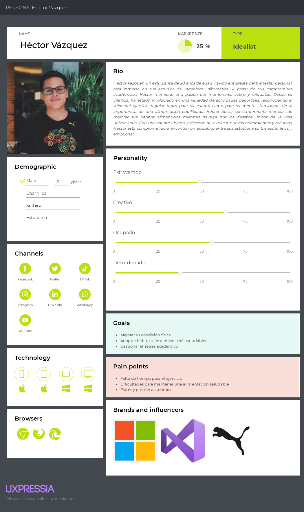
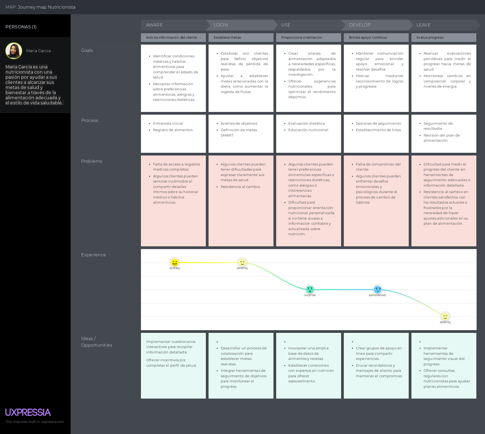
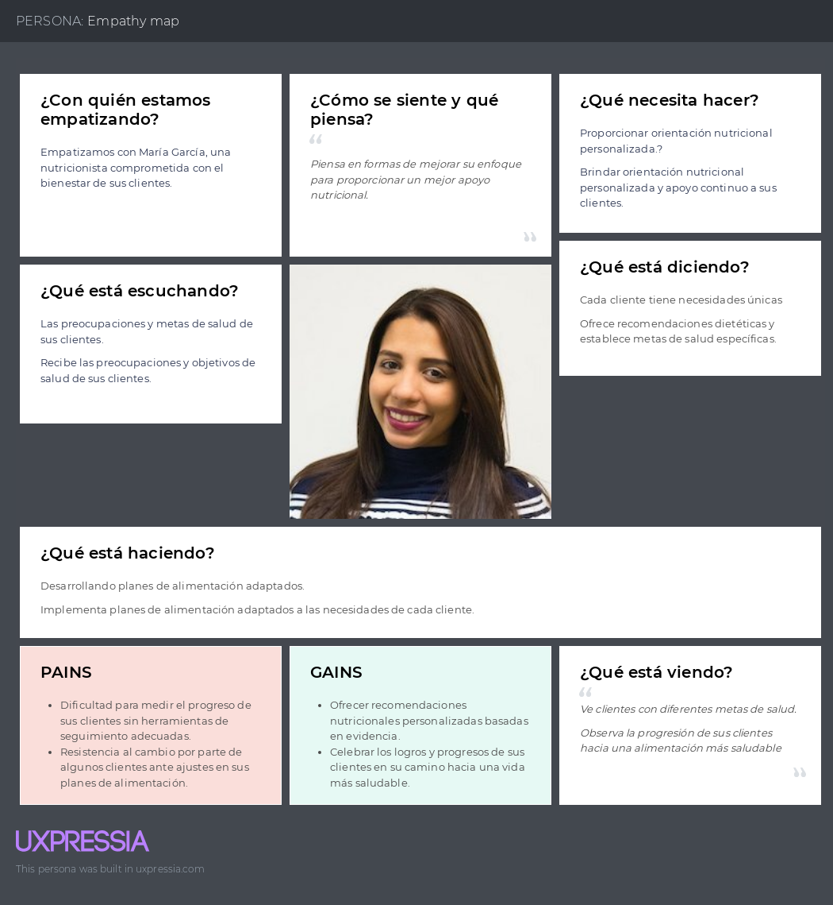
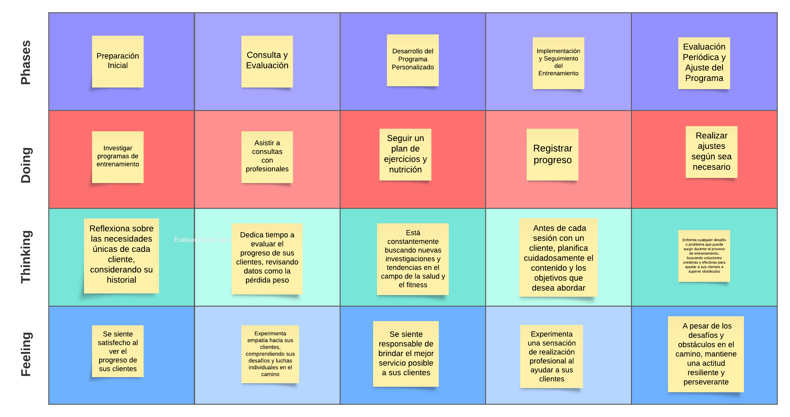

# **Capítulo II: Requirements Elicitation & Analysis**

## 2.1. Competidores

Se ha reconocido a Noom, Peloton y FitnessPal como los principales competidores de nuestro proyecto. Este análisis nos permitirá adquirir un conocimiento más profundo sobre el funcionamiento del mercado, así como las ventajas y desventajas que poseemos en comparación con ellos. Esta información será fundamental para desarrollar estrategias y tácticas efectivas dentro del sector seleccionado.

### 2.1.1. Análisis competitivo

<table>
  <tr>
    <th colspan="7" valign="top"><b>Competitive Analysis Landscape</b></th>
  </tr>
  <tr>
    <td colspan="2" rowspan="2">Objetivo del análisis</td>
    <td colspan="5">¿Cómo analiza, produce y enfrenta el mercado mi competencia?</td>
  </tr>
  <tr>
    <td colspan="5">Este análisis se realizó con la finalidad de poder identificar a nuestros potenciales competidores e idear estrategias y tácticas para diferenciarnos de estos.</td>
  </tr>
  <tr>
    <td colspan="3">Nombre y logo</td>
    <td colspan="1" valign="top" style="font-weight: bold;">
        GymPal
         
        

                
        

    <td colspan="1" valign="top" style="font-weight: bold;">
      Noom
        

                
        

    </td>
    <td colspan="1" valign="top" style="font-weight: bold;">
      Peloton
        

                
            

        </td>
    <td colspan="1" valign="top" style="font-weight: bold;" >
      MyFitnessPal
        

                
        

    </td>
  </tr>
  <tr>
    <td colspan="1" rowspan="2">
Perfil
</td>
    <td colspan="2">Overview</td>
    <td colspan="1" valign="top">Aplicación web que conecta a usuarios interesados en ejercitarse y mantener una alimentación saludable con nutriólogos y coaches especializados.</td>
    <td colspan="1" valign="top">Aplicación web que combina tecnología con coaching humano para ayudar a los usuarios a desarrollar hábitos saludables en torno a la alimentación, el ejercicio y el bienestar mental</td>
    <td colspan="1" valign="top">Aplicación web que proporciona acceso a una variedad de clases de fitness en vivo y bajo demanda, incluidas clases de ciclismo, carrera, yoga y más.</td>
    <td colspan="1" valign="top">Aplicación web que permite a los usuarios realizar un seguimiento detallado de su dieta y ejercicioy. Realiza un seguimiento del progreso físico a lo largo del tiempo.</td>
  </tr>
  <tr>
    <td colspan="2">Ventaja competitiva</td>
    <td colspan="1" valign="top">Permite a los usuarios conectar con nutriólogos y coaches especializados, recibiendo recomendaciones personalizadas y planes de acción para alcanzar sus objetivos de salud y fitness. Con características adicionales como seguimiento de progreso, registro de alimentos, y acceso a contenido exclusivo, nuestra plataforma ofrece una experiencia integral para ayudar a los usuarios a lograr sus metas de bienestar de manera efectiva y sostenible.</td>
    <td colspan="1" valign="top">Permite a los usuarios desarrollar hábitos saludables personalizados con el apoyo de coaches expertos, facilitando cambios de comportamiento positivos a largo plazo.</td>
    <td colspan="1" valign="top">Permite acceder a una amplia variedad de clases de fitness en vivo y bajo demanda desde la comodidad del hogar, proporcionando una experiencia interactiva y motivadora para los usuarios.</td>
    <td colspan="1" valign="top">Permite realizar un seguimiento detallado de la dieta y el ejercicio, ofreciendo una extensa base de datos de alimentos y ejercicios para ayudar a los usuarios a alcanzar sus objetivos de salud y fitness con mayor precisión y eficacia.</td>
  </tr>
  <tr>
    <td colspan="1" rowspan="2">
Perfil de Marketing
</td>
    <td colspan="2">Mercado objetivo</td>
    <td colspan="1" valign="top">Usuarios entre 18 y 65 años que buscan mejorar su salud y condición física a través de la combinación de ejercicio, alimentación saludable y asesoramiento profesional.</td>
    <td colspan="1" valign="top">Usuarios entre 18 y 65 años que buscan desarrollar hábitos saludables personalizados y recibir apoyo de coaches expertos para lograr cambios de comportamiento positivos a largo plazo.</td>
    <td colspan="1" valign="top">Usuarios entre 18 y 65 años que desean acceder a una amplia variedad de clases de fitness en vivo y bajo demanda desde la comodidad del hogar, buscando una experiencia interactiva y motivadora para mejorar su condición física.</td>
    <td colspan="1" valign="top">Usuarios entre 18 y 65 años que están interesados en realizar un seguimiento detallado de su dieta y ejercicio, utilizando una extensa base de datos de alimentos y ejercicios para alcanzar sus objetivos de salud y fitness de manera precisa y eficaz.</td>
  </tr>
  <tr>
    <td colspan="2">Estrategias de marketing</td>
    <td colspan="1" valign="top">GymPal realiza colaboraciones con influencers locales en el ámbito del fitness, la nutrición o el bienestar para promocionar tu aplicación. Estos influencers pueden tener una audiencia comprometida y localizada.</td>
    <td colspan="1" valign="top">Ofrecen contenido efectivo, creando y compartiendo artículos, videos y recursos relacionados con la salud, el fitness y la nutrición en sus canales digitales</td>
    <td colspan="1" valign="top">Ofrecen una amplia variedad de clases de fitness en vivo y bajo demanda a través de su plataforma</td>
    <td colspan="1" valign="top">Ofrecen a sus usuarios a compartir sus logros y progresos en las redes sociales utilizando el hashtag oficial de la marca.</td>
  </tr>
  <tr>
    <td colspan="1" rowspan="3">
Perfil de Producto
</td>
    <td colspan="2">Productos & Servicios</td>
    <td colspan="1" valign="top">-Permite a los usuarios conectarse con nutriólogos y coaches especializados en salud y fitness. - Proporciona recomendaciones personalizadas según los objetivos individuales de cada usuario, ya sea bajar de peso, definir músculos o aumentar volumen, entre otros. - Permite a los usuarios realizar un seguimiento de su progreso a lo largo del tiempo, ya sea en términos de peso, medidas, hábitos alimenticios o rendimiento en el ejercicio. - Facilita la conexión con nutriólogos, coaches independientes y gimnasios locales donde los    usuarios pueden recibir apoyo adicional y realizar sus ejercicios.
    </td>
    <td colspan="1" valign="top">-Ofrece coaching personalizado que combina tecnología avanzada con asesoramiento humano para ayudar a los usuarios a desarrollar hábitos saludables. -Proporciona herramientas y recursos para la planificación de comidas, incluyendo recetas saludables y sugerencias de alimentos. -Permite a los usuarios realizar un seguimiento de su progreso en términos de pérdida de peso, actividad física y hábitos alimenticios a lo largo del tiempo.</td>
    <td colspan="1" valign="top">-Ofrece una amplia variedad de clases de fitness en vivo y bajo demanda, que incluyen ciclismo, carrera, yoga y más. -Ofrece equipos de ejercicio en el hogar, como bicicletas estáticas y cintas de correr, para una experiencia completa de entrenamiento. -Fomenta la participación de la comunidad a través de eventos virtuales, grupos de apoyo y desafíos de fitness para mantener a los usuarios motivados y comprometidos.</td>
    <td colspan="1" valign="top">-Permite a los usuarios realizar un seguimiento detallado de su consumo de alimentos y actividad física, proporcionando datos y análisis para ayudar a alcanzar sus metas de salud y fitness. -Ofrece una amplia base de datos de alimentos que facilita a los usuarios encontrar y registrar información nutricional precisa sobre sus comidas. -Cuenta con una comunidad activa en línea donde los usuarios pueden compartir sus logros, obtener apoyo y motivación de otros miembros.</td>
  </tr>
  <tr>
      <td colspan="2">Precios & Costos</td>
      <td colspan="1" valign="top"></td>
      <td colspan="1" valign="top">-Periodo de prueba (7 a 14 dias): $0.50 hasta $18. -Plan mensual de renovación automática: $70 USD por mes. -Plan anual de renovacion automatica:  $17.50 USD por mes.</td>
      <td colspan="1" valign="top">Los precios pueden incluir el costo inicial del equipo (como bicicletas estáticas o cintas de correr) más una tarifa mensual de suscripción que suele rondar los $39 al mes para acceso completo a clases y contenido exclusivo.</td>
      <td colspan="1" valign="top">-Free: $0 (seguimiento de la dieta y el ejercicio) -Premium: $19.99 mensual</td>
  </tr>
  <tr>
    <td colspan="2">Canales de distribución (Web y/o Móvil)</td>
    <td colspan="1" valign="top">Redes sociales y aplicación web</td>
    <td colspan="1" valign="top">Página web y aplicación móvil</td>
    <td colspan="1" valign="top">Página web y aplicación móvil</td>
    <td colspan="1" valign="top">Página web y aplicación móvil</td>
  </tr>
  <tr>
    <td colspan="1" rowspan="5">
Análisis SWOT
</td>
    <td colspan="6">Realice esto para su startup y sus competidores. Sus fortalezas deberían apoyar sus oportunidades y contribuir a lo que ustedes definen como su posible ventaja competitiva.</td>
  </tr>
  <tr>
    <td colspan="2">Fortalezas</td>
    <td colspan="1" valign="top">Conexión directa con nutriólogos y coachs</td>
    <td colspan="1" valign="top">Ofrece recomendaciones y seguimiento personalizados basados en datos de usuario</td>
    <td colspan="1" valign="top">Comunidad comprometida</td>
    <td colspan="1" valign="top">Amplia base de datos de alimentosInterfaz fácil de usar.</td>
  </tr>
  <tr>
    <td colspan="2">Debilidades</td>
    <td colspan="1" valign="top">Dependencia de la disponibilidad de profesionales</td>
    <td colspan="1" valign="top">Costo de suscripción</td>
    <td colspan="1" valign="top">Costo inicial elevado Dependencia del equipo</td>
    <td colspan="1" valign="top">La versión gratuita de MyFitnessPal muestra anuncios intrusivos que pueden afectar la experiencia del usuario y disminuir la satisfacción.</td>
  </tr>
  <tr>
    <td colspan="2">Oportunidades</td>
    <td colspan="1" valign="top">Explorar la posibilidad de ofrecer servicios adicionales, como planes de comida personalizados o seguimiento de progreso a largo plazo.</td>
    <td colspan="1" valign="top">La expansión a mercados internacionales ofrece oportunidades para llegar a nuevas audiencias y aumentar la base de usuarios.</td>
    <td colspan="1" valign="top">Peloton puede expandir su oferta de clases y contenido para cubrir una variedad aún más amplia de intereses y necesidades de fitness.</td>
    <td colspan="1" valign="top">Integración con dispositivos de fitness populares, como Fitbit o Garmin, para proporcionar a los usuarios una experiencia más completa y personalizada.</td>
  </tr>
  <tr>
    <td colspan="2">Amenazas</td>
    <td colspan="1" valign="top">Competencia creciente</td>
    <td colspan="1" valign="top">Cambios en las tendencias de salud o en las preferencias del consumido</td>
    <td colspan="1" valign="top">Cambios en las preferencias del consumidor.</td>
    <td colspan="1" valign="top">La competencia en el mercado de aplicaciones de salud y fitness es feroz, con una variedad de opciones disponibles para los usuarios</td>
  </tr>
</table>

### 2.1.2. Estrategias y tácticas frente a competidores

Nuestro enfoque principal radica en ofrecer una experiencia de usuario excepcional, lo que nos diferenciará de la competencia. Nos comprometemos a garantizar que nuestra aplicación sea intuitiva, atractiva visualmente y repleta de características útiles que superen las expectativas de nuestros usuarios.

Destacaremos las características únicas de nuestra aplicación, resaltando un enfoque personalizado en la conexión entre usuarios y profesionales de la salud, además de incluir contenido exclusivo e integrar tecnología innovadora.
Enfatizaremos la capacidad de nuestra aplicación para adaptarse a las necesidades individuales de los usuarios, ofreciendo recomendaciones personalizadas y ajustes basados en datos recopilados, utilizando algoritmos avanzados y solicitando retroalimentación regular de los usuarios.
Estableceremos asociaciones con influencers, nutriólogos reconocidos y entrenadores personales para aumentar la credibilidad y la visibilidad de nuestra aplicación, organizando eventos de lanzamiento y colaboraciones específicas para generar interés y confianza en nuestra marca.
Atender las necesidades y comentarios de nuestros usuarios para brindar un servicio al cliente sobresaliente es fundamental para destacarnos en comparación con la competencia. Esto nos permite garantizar una experiencia positiva y cultivar la lealtad de nuestros usuarios existentes, al mismo tiempo que atraemos a nuevos clientes hacia nuestra plataforma.

## 2.2. Entrevistas

### 2.2.1. Diseño de entrevistas

### 2.2.2. Registro de entrevistas

### 2.2.3. Análisis de entrevistas

## 2.3. Needfinding

### 2.3.1. User Personas

<strong>Segmento objetivo: Usuario</strong>

<strong>Segmento objetivo: Entrenador</strong>

<strong>Segmento objetivo: Nutricionista</strong>

### 2.3.2. User Task Matrix

<table align="center" border="1" width="90%" style="text-align:center;">
    <tr>
        <td>User Task Matrix</td>
        <td colspan=2>
            Usuarios interesados en mejorar su salud y estado físico
        </td>
        <td colspan=2>
            Profesionales de la salud y el fitness
        </td>
    </tr>
    <tr>
        <td>
        </td>
        <td>
            <b>Frequency</b>
        </td>
        <td>
            <b>Importance</b>
        </td>
        <td>
            <b>Frequency</b>
        </td>
        <td>
            <b>Importance</b>
        </td>
    </tr>
    <tr>
        <td>
            Establecer objetivos de salud y fitness
        </td>
        <td>
            Alta
        </td>
        <td>
            Siempre
        </td>
        <td>
            Alta
        </td>
        <td>
            Baja
        </td>
    </tr>
    <tr>
        <td>
            Buscar y conectarse con nutriólogos y coaches
        </td>
        <td>
            Alta
        </td>
        <td>
            Alta
        </td>
        <td>
            Alta
        </td>
        <td>
            Baja
        </td>
    </tr>
    <tr>
        <td>
            Recibir recomendaciones personalizadas sobre dieta y ejercicio.
        </td>
        <td>
            Alta
        </td>
        <td>
            A menudo
        </td>
        <td>
            Alta
        </td>
        <td>
            A veces
        </td>
    </tr>
     <tr>
        <td>
            Realizar seguimiento de la ingesta de alimentos y calorías.
        </td>
        <td>
            Alta
        </td>
        <td>
            Siempre
        </td>
        <td>
            Alta
        </td>
        <td>
            Baja
        </td>
    </tr>
     <tr>
        <td>
            Registrar actividades físicas y ejercicios realizados.
        </td>
        <td>
            Alta
        </td>
        <td>
            A menudo
        </td>
        <td>
            Alta
        </td>
        <td>
            A veces
        </td>
    </tr>
     <tr>
        <td>
            Consultar el progreso hacia los objetivos de salud.
        </td>
        <td>
            Alta
        </td>
        <td>
            Siempre
        </td>
        <td>
            Alta
        </td>
        <td>
            A veces
        </td>
    </tr>
     <tr>
        <td>
            Solicitar seguimiento y retroalimentación de los profesionales de la salud
        </td>
        <td>
            Alta
        </td>
        <td>
            A veces
        </td>
        <td>
            Alta
        </td>
        <td>
            A menudo
        </td>
    </tr>
     <tr>
        <td>
            Programar recordatorios y alarmas para actividades diarias
        </td>
        <td>
            Alta
        </td>
        <td>
            A menudo
        </td>
        <td>
            Alta
        </td>
        <td>
            A veces
        </td>
    </tr>
     <tr>
        <td>
            Interactuar con otros usuarios en la comunidad de la aplicación
        </td>
        <td>
            Alta
        </td>
        <td>
            A menudo
        </td>
        <td>
            Alta
        </td>
        <td>
            A veces
        </td>
    </tr>
     <tr>
        <td>
            Explorar programas de entrenamiento específicos
        </td>
        <td>
            Alta
        </td>
        <td>
            A menudo
        </td>
        <td>
            Alta
        </td>
        <td>
            Baja
        </td>
    </tr>
</table>

### 2.3.3. User Journey Mapping

<strong>Segmento objetivo: Usuario</strong>

<strong>Segmento objetivo: Entrenador</strong>

<strong>Segmento objetivo:: Nutricionista</strong>

### 2.3.4. Empathy Mapping

<strong>Segmento objetivo: Usuario</strong>

<strong>Segmento objetivo: Entrenador</strong>

<strong>Segmento objetivo: Nutricionista </strong>

### 2.3.5. As-is Scenario Mapping

<strong>Segmento objetivo: Usuario</strong>

<strong>Segmento objetivo: Entrenador</strong>

<strong>Segmento objetivo: Nutricionista </strong>

## 2.4. Ubiquitous Language

1. **Nutricionista**: Un profesional especializado en el estudio de la nutrición y sus efectos en la salud. En el contexto de nuestra aplicación, un nutricionista proporciona recomendaciones dietéticas personalizadas y orientación a los usuarios.

2. **Entrenador de Fitness**: Una persona capacitada para diseñar programas de fitness y proporcionar orientación y motivación a las personas que buscan mejorar su salud física y niveles de condición física.

3. **Establecimiento de Objetivos**: El proceso de identificar objetivos específicos y medibles que un individuo desea lograr dentro de un cierto período de tiempo. En nuestra aplicación, los usuarios pueden establecer objetivos relacionados con la pérdida de peso, el aumento de masa muscular o la mejora general de la condición física.

4. **Seguimiento de Comidas**: La práctica de registrar y monitorear los tipos y cantidades de alimentos consumidos a lo largo del día. Los usuarios pueden hacer un seguimiento de sus comidas usando nuestra aplicación para obtener información sobre sus hábitos alimenticios y progreso hacia sus objetivos nutricionales.

5. **Registro de Ejercicios**: El acto de documentar las actividades físicas y los entrenamientos completados por un individuo. Nuestra aplicación permite a los usuarios registrar sus sesiones de ejercicio, incluyendo duración, intensidad y tipo de actividad, para seguir su progreso físico.

6. **Evaluación de Salud**: Una evaluación integral del estado de salud actual de un individuo, que incluye factores como la composición corporal, la salud cardiovascular y la función metabólica. Los usuarios pueden someterse a una evaluación de salud al comenzar el programa para establecer mediciones y objetivos de referencia.

7. **Monitoreo de Progreso**: El proceso continuo de seguimiento y evaluación de los cambios en métricas clave de salud y condición física con el tiempo. Nuestra aplicación proporciona herramientas para que los usuarios monitoreen su progreso, como cambios de peso, medidas corporales y mejoras en el rendimiento de los ejercicios.

8. **Cambio de Comportamiento**: El proceso de adoptar nuevos hábitos y elecciones de estilo de vida para apoyar objetivos de salud y condición física a largo plazo. Nuestra aplicación se centra en ayudar a los usuarios a desarrollar cambios de comportamiento sostenibles a través de la educación, motivación y coaching personalizado.

9. **Apoyo Comunitario**: Una red de apoyo de individuos con objetivos de salud y condición física similares que brindan aliento, responsabilidad y motivación mutua. Nuestra aplicación fomenta un sentido de comunidad entre los usuarios a través de funciones como desafíos grupales, foros y compartición social.

10. **Plan de Suscripción**: Una opción de membresía paga que otorga a los usuarios acceso a funciones y contenido premium dentro de la aplicación por un período especificado, generalmente mensual o anual. Los usuarios pueden elegir entre varios planes de suscripción según sus necesidades y preferencias.

11. **Perfil de Usuario (User Profile)**: La representación digital de un usuario dentro de la aplicación, que incluye información personal, preferencias, historial de actividad y progreso hacia objetivos.

12. **Notificación (Notification)**: Mensajes o alertas enviadas a los usuarios para informarles sobre eventos importantes, como recordatorios de entrenamiento, actualizaciones de progreso o nuevas interacciones de la comunidad.

13. **Dieta Balanceada (Balanced Diet)**: Un plan de alimentación que proporciona al cuerpo los nutrientes necesarios en las cantidades adecuadas para mantener la salud y el bienestar general.

14. **Entrenamiento de Fuerza (Strength Training)**: Ejercicios diseñados para aumentar la fuerza muscular, mejorar la resistencia y promover el crecimiento y desarrollo muscular.

15. **Consulta (Consultation)**: Una sesión individual con un profesional de la salud o un entrenador de fitness para discutir objetivos, recibir orientación personalizada y establecer un plan de acción.

16. **Registro de Progreso (Progress Tracking)**: El proceso de documentar y visualizar los cambios y mejoras en el rendimiento físico y la salud a lo largo del tiempo, utilizando datos como medidas corporales, gráficos de peso y registros de ejercicios.

17. **Motivación (Motivation)**: El impulso interno o externo que dirige el comportamiento de una persona hacia el logro de metas y objetivos relacionados con la salud y el fitness.

18. **Hábitos Saludables (Healthy Habits)**: Comportamientos y prácticas diarias que contribuyen al bienestar físico, mental y emocional, como dormir lo suficiente, mantenerse hidratado y practicar ejercicio regularmente.

19. **Foro de Discusión (Discussion Forum)**: Una plataforma en línea donde los usuarios pueden intercambiar ideas, hacer preguntas, compartir experiencias y brindar apoyo mutuo relacionado con la salud y el fitness.

20. **Planificación de Eventos (Event Planning)**: La organización y coordinación de actividades grupales, como sesiones de entrenamiento, desafíos o eventos comunitarios, para fomentar la participación y el compromiso de los usuarios.

# **Capítulo III: Requirements Specification**
## 3.1. To-Be Scenario Mapping

Basado en nuestras soluciones elaboramos un to be Scenario Mapping para observar cómo es que nuestras ideas podrían abordar las necesidades del usuario.

<strong>Segmento objetivo: Usuario</strong>

| USER PERSON |  | HÉCTOR VÁZQUEZ |  |
|-----------|-----------|-----------|-----------|
| PHASES    |    Búsqueda de información sobre programas de entrenamiento        |     Selección de un programa de entrenamiento adecuado a sus necesidades y objetivos      |       Inscripción en el programa de entrenamiento elegido.    |
| DOING    |     Hace uso de la aplicación web explorando diferentes tipos de programas de entrenamiento, incluyendo ejercicios específicos, duración y niveles de intensidad  |     Investiga en línea sobre las opciones disponibles y compara características como la duración del programa, el enfoque de entrenamiento y las revisiones de otros usuarios     |     Completa el proceso de registro en línea para inscribirte en el programa de entrenamiento seleccionado, proporcionando la información necesaria y realizando el pago si es necesario.      |
| THINKING    |      Piensa que evaluar detenidamente sus metas personales de fitness te ayudará a encontrar el programa más adecuado para ti     |      Piensa que es importante evaluar cuidadosamente cada opción de programa de entrenamiento para garantizar que se alinee con tus metas de fitness.     |     Piensa que al inscribirte en el programa adecuado, estás dando un paso significativo hacia el logro de tus objetivos de fitness personales.      |
| FEELING    |     Se siente intrigado por las diferentes opciones de programas de entrenamiento disponibles      |     Se siente abrumado por la cantidad de opciones disponibles y tener dificultades para decidir cuál es la mejor para él.      |     Se siente satisfecho al dar el primer paso hacia el logro de sus objetivos de fitness.      |
 

<strong>Segmento objetivo: Entrenador</strong>

| USER PERSON |  | Pablo Herrera |  |
|-----------|-----------|-----------|-----------|
| PHASES    |     Diseña programas de entrenamiento adaptados a las necesidades y objetivos de cada cliente      |   Proporciona información detallada sobre los diferentes programas de entrenamiento disponibles        | Asegura que el cliente esté satisfecho con el programa de entrenamiento propuesto y lo acepte
| DOING    |     Guía al cliente a través de cada ejercicio y actividad incluido en el programa de entrenamiento      |     Monitorea el progreso del cliente y realiza ajustes en el programa de entrenamiento según sea necesario para garantizar resultados óptimos      |  Proporciona aliento constante y motivación al cliente para mantener su compromiso con el programa de entrenamiento
| THINKING    |     Piensa que evaluar el progreso del cliente en relación con los objetivos de entrenamiento establecidos y analizar su desempeño es crucial para ajustar el programa según sea necesario      |     Piensa que reflexionar sobre la efectividad del programa actual y considerar si se requieren ajustes para abordar las necesidades cambiantes del cliente es una parte importante de su trabajo como entrenador      |  Piensa en formas creativas de mantener al cliente comprometido y motivado.
| FEELING    |     Se siente satisfecho al evaluar el progreso del cliente y analizar su desempeño durante las sesiones de entrenamiento      |     Se siente preocupado por la efectividad del programa actual y su impacto en el éxito del cliente      | Se siente motivado al mantener al cliente comprometido y satisfecho con su progreso y resultados

 

<strong>Segmento objetivo: Nutricionista</strong>

| USER PERSON |  | Maria Garcia |  |
|-----------|-----------|-----------|-----------|
| PHASES   | Revisa el historial médico y los hábitos alimenticios del cliente antes de la consulta | Proporciona orientación nutricional detallada y basada en evidencia durante la consulta | Sigue en contacto con el cliente a través de la aplicación para brindar apoyo continuo
| DOING    | Accede y analiza información del cliente para comprender su situación de salud y patrones alimenticios | Durante la consulta, María proporciona orientación detallada y basada en evidencia, adaptada a las necesidades específicas de cada cliente | Se mantiene en contacto con el cliente a través de la aplicación para brindar apoyo continuo, ofreciendo motivación, resolviendo dudas y ajustando las recomendaciones según sea necesario
| THINKING    | Piensa en como los datos recopilados pueden proporcionar una visión completa de la salud del cliente y orientar las recomendaciones futuras | Piensa en como adaptar las recomendaciones para abordar las necesidades específicas del cliente y ayudarlo a alcanzar sus objetivos de salud |  Piensa en estrategias para mantener la motivación del cliente y proporcionar orientación constante a medida que avanza en su viaje de salud y bienestar
| FEELING    | Siente confianza al obtener información detallada para ofrecer recomendaciones precisas y personalizadas | Siente satisfacción al ayudar al cliente a comprender y mejorar su relación con la alimentación y la salud | Siente gratificación al ver el progreso del cliente y saber que su guía está marcando una diferencia positiva en su bienestar
 

## 3.2. User Stories

| Epic / Story ID | Título | Descripción | Criterios de Aceptación | Epic ID |
|-----------------|--------|-------------|-------------------------|---------|
| EP01/US01       | Creación de cuenta de usuario   | Como usuario, quiero poder crear una cuenta para acceder a todas las funcionalidades de la aplicación. | Given que el usuario ha ingresado sus datos de registro correctamente,   When el usuario hace clic en el botón "Registrarse",   Then la cuenta del usuario se crea exitosamente y se le redirige a la página de inicio.  | EP01
| EP01/US02 | Establecimiento de objetivos de salud y fitness | Como usuario, quiero establecer mis objetivos de salud y fitness al registrarme en la aplicación. | Given que el usuario ha iniciado sesión en su cuenta,   When el usuario selecciona la opción "Establecer objetivos" en su perfil,   Then el usuario puede ingresar sus metas de salud y fitness, incluyendo peso objetivo, porcentaje de grasa corporal, etc. | EP01 |
| EP02/US03 | Recibir recomendaciones personalizadas sobre dieta y ejercicio | Como usuario, quiero recibir recomendaciones personalizadas sobre dieta y ejercicio basadas en mis objetivos y preferencias. | Given que el usuario ha ingresado su información de perfil y metas de fitness,  When el sistema procesa los datos del usuario,  Then el usuario recibe recomendaciones personalizadas sobre dieta y ejercicio basadas en sus metas y preferencias. | EP02 |
| EP03/US01 | Registro y seguimiento de la ingesta diaria de alimentos y calorías | Como usuario, quiero poder registrar y realizar un seguimiento de mi ingesta diaria de alimentos y calorías. | Given que el usuario ha ingresado su comida diaria en la aplicación,  When el usuario guarda la entrada de comida,  Then la aplicación registra y sigue la ingesta diaria de alimentos y calorías del usuario. | EP03 |
| EP02/US04 | Registro y seguimiento de actividades físicas y ejercicios | Como usuario, quiero poder registrar y hacer un seguimiento de todas mis actividades físicas y ejercicios realizados. | Given que el usuario ha completado una sesión de ejercicio o actividad física,  When el usuario registra la actividad en la aplicación,  Then la aplicación registra y sigue la actividad física y los ejercicios del usuario. | EP02 |
| EP02/US05 | Consulta de progreso en el tablero personalizado | Como usuario, quiero consultar mi progreso hacia mis objetivos de salud y fitness en un tablero personalizado con interfaz atractiva. | Given que el usuario ha ingresado a su cuenta,  When el usuario accede al tablero de progreso,  Then el usuario puede ver gráficos y estadísticas detalladas de su progreso en términos de pérdida de peso, ganancia muscular, etc. | EP02 |
| EP02/US06 | Exploración de programas de entrenamiento específicos | Como usuario, quiero explorar una variedad de programas de entrenamiento específicos adaptados a mis necesidades y preferencias. | Given que el usuario ha navegado a la sección de programas de entrenamiento,  When el usuario filtra los programas por tipo, duración, nivel de dificultad, etc.,  Then el usuario puede explorar y seleccionar programas de entrenamiento específicos según sus preferencias. | EP02 |
| EP02/US07 | Solicitud de seguimiento y retroalimentación personalizada | Como usuario, quiero solicitar seguimiento y retroalimentación personalizada de profesionales de la salud y entrenadores. | Given que el usuario ha completado una sesión de ejercicio o actividad física,  When el usuario solicita retroalimentación en la aplicación,  Then el usuario recibe seguimiento y retroalimentación personalizada de un entrenador o profesional de fitness. | EP02 |
| EP04/US01 | Interacción en la comunidad de la aplicación | Como usuario, quiero interactuar con otros usuarios en una comunidad dentro de la aplicación para compartir experiencias y motivación. | Given que el usuario ha iniciado sesión en la aplicación,  When el usuario navega a la sección de comunidad o foros,  Then el usuario puede interactuar con otros miembros de la comunidad, publicar preguntas, respuestas, etc. | EP04 |
| EP06/US01 | Acceso a herramientas de análisis de datos | Como usuario, quiero acceder a herramientas de análisis y visualización de datos para comprender mejor mi progreso y áreas de mejora. | Given que el usuario ha ingresado a su cuenta en la aplicación,  When el usuario accede a las herramientas de análisis de datos,  Then el usuario puede visualizar y analizar datos detallados sobre su progreso y estadísticas de salud y fitness. | EP06 |
| EP04/US03 | Participación en desafíos y competiciones | Como usuario, quiero participar en desafíos y competiciones dentro de la comunidad para mantenerme motivado y comprometido. | Given que el usuario ha ingresado a la sección de desafíos y competiciones,  When el usuario selecciona un desafío para participar,  Then el usuario puede inscribirse y participar en desafíos y competiciones para motivarse y competir con otros usuarios. | EP04 |
| EP05/US01 | Acceso a contenido exclusivo y características premium | Como usuario, quiero acceder a contenido exclusivo y características premium mediante una suscripción mensual o anual | Given que el usuario ha adquirido una suscripción premium o acceso exclusivo,   When el usuario accede a la sección de contenido premium,  Then el usuario puede disfrutar de características exclusivas, como videos de entrenamiento, artículos, etc.| EP05 |
| EP07/US01 | Acceder a información sobre programas de alimentación y ejercicios | Como visitante del sitio web, quiero poder acceder fácilmente a información detallada sobre diferentes programas de alimentación y ejercicios para poder tomar decisiones informadas sobre cómo mejorar mi salud y condición física | Given estoy en la página principal del sitio web   When hago clic en la sección de "Programas de Alimentación y Ejercicios"   Then se me redirige a una página donde puedo ver una lista de programas disponibles, cada uno con una descripción detallada de sus características, objetivos y beneficios | EP07 |
| EP07/US02 | Ver testimonios de éxito de otros usuarios | Como visitante interesado en mejorar mi salud, deseo poder ver testimonios reales de otros usuarios que hayan tenido éxito con el programa de alimentación y ejercicios ofrecido en el sitio web, para sentirme motivado y confiado en los resultados potenciales | Given estoy navegando por el sitio web   When accedo a la sección de "Testimonios de Usuarios" desde el menú principal   Then se me muestra una página con una recopilación de testimonios reales de usuarios, acompañados de imágenes y breves historias de sus logros y experiencias positivas con el programa de alimentación y ejercicios | EP07 |
| EP07/US03 | Obtener respuestas a preguntas frecuentes | Como usuario del sitio web, quiero poder acceder a una sección de preguntas frecuentes (FAQ) para encontrar respuestas claras y concisas a las preguntas más comunes relacionadas con la salud, la nutrición y el ejercicio | Given estoy en la página principal del sitio web   When navego hacia la sección de "Preguntas Frecuentes" en el pie de página   Then encuentro una lista organizada de preguntas comunes sobre salud, nutrición y ejercicio, junto con respuestas claras y concisas que abordan cada una de ellas | EP07|
| EP07/US04 | Explorar opciones de membresía premium | Como visitante interesado en obtener beneficios adicionales, deseo poder explorar las opciones de membresía premium ofrecidas en el sitio web, que podrían incluir acceso a contenido exclusivo, descuentos en productos y servicios, y sesiones de asesoramiento personalizado | Given estoy en la página principal del sitio web   When hago clic en la sección de "Membresía Premium" desde el menú principal   Then se me muestra una página detallada que describe los beneficios exclusivos de la membresía premium, como acceso a contenido exclusivo, descuentos especiales y sesiones de asesoramiento personalizado | EP07 |
| EP07/US05 | Buscar y conectarse con nutriólogos y coaches | Como usuario interesado en obtener orientación de profesionales de la salud, quiero buscar y conectarme con nutriólogos y coaches en el sitio web para recibir asesoramiento personalizado sobre mi salud y condición física | Given que decido conectarme con un profesional de la salud,   When selecciono la opción de contacto,   Then debería poder enviar un mensaje o solicitud de cita directamente desde el sitio web.| EP07 |
| EP02/US08 | Seguimiento del progreso en programas de entrenamiento | Como usuario, quiero poder seguir mi progreso en los programas de entrenamiento diseñados por Pablo, para poder ver mis mejoras y ajustar mis actividades según sea necesario. | Given que el usuario ha seleccionado un programa de entrenamiento diseñado por Pablo,  When el usuario completa una sesión de entrenamiento o actividad relacionada,  Then el sistema registra el progreso del usuario, incluyendo la duración del entrenamiento, el tipo de actividad realizada, las calorías quemadas, y cualquier otro dato relevante.  Given que el usuario accede a la sección de progreso de su cuenta,  When el usuario selecciona el programa de entrenamiento diseñado por Pablo,  Then el usuario puede ver un resumen detallado de su progreso, incluyendo estadísticas, gráficos y comparativas con objetivos preestablecidos. | EP02 |
| EP08/US01 | Desarrollar perfiles detallados de expertos en nutrición | Como usuario interesado en recibir consejos nutricionales, quiero poder acceder a perfiles detallados de expertos en nutrición que incluyan su experiencia, credenciales, áreas de especialización y testimonios de clientes anteriores para generar confianza. | Given que soy un usuario de la aplicación,  When accedo a la sección de expertos en nutrición,  Then veo perfiles detallados de cada experto, incluyendo su experiencia, credenciales, áreas de especialización y testimonios de clientes anteriores. | EP08 |
| EP08/US01 | Mostrar testimonios de clientes satisfechos | Como usuario, quiero poder ver testimonios auténticos de otros clientes que hayan recibido consejos nutricionales y servicios personalizados, destacando los resultados positivos obtenidos y su satisfacción con la experiencia. | Given que accedo a la sección de testimonios en la aplicación,   When visualizo los testimonios disponibles,   Then veo testimonios auténticos de clientes, incluyendo sus resultados positivos y satisfacción con la experiencia. | EP08 |
| EP08/US02 | Realizar encuestas de satisfacción del cliente | Como usuario, quiero realizar encuestas periódicas para que puedan recopilar mis comentarios, opiniones y sugerencias sobre mi experiencia en la aplicación. | Given que accedo a la sección de encuestas de satisfacción en la aplicación,   When completo la encuesta proporcionando mis comentarios y sugerencias,   Then mis respuestas son recopiladas para mejorar la experiencia del usuario. | EP08 |
| EP09/US01 | Desarrollar plataforma de ayuda y consultas en línea | Como equipo de desarrollo, queremos desarrollar una plataforma en línea donde los clientes puedan acceder a recursos de ayuda, preguntas frecuentes y enviar consultas que serán respondidas dentro de un plazo por un especialista en nutrición. | Given que estoy en la página principal de la aplicación,   When navego a la sección de ayuda y consultas,   Then encuentro recursos de ayuda, preguntas frecuentes y un formulario para enviar consultas. | EP09 |

## 3.3. Impact Mapping
El Impact mapping es una técnica de planificación ligera y colaborativa para los equipos, como el nuestro, que desean tener un gran impacto con los productos de software. Se basa en el diseño de la interacción del usuario, la planificación basada en resultados y la asignación mental.
 

## 3.4. Product Backlog 
Para el buen gestión de nuestro proyecto, se realizo el Product Backlog para elaborar un listado de orden de prioridad de lo criterios que deben de tenerse en cuenta durante el desarrollo del proyecto.

# Product Backlog

| Orden | User Story Id | Título | Descripción | Story Points(1/2/3/5/8) |
|-------|---------------|--------|-------------|--------------|
| 1     | EP01/US01     | Creación de cuenta de usuario | Como usuario, quiero poder crear una cuenta para acceder a todas las funcionalidades de la aplicación. | 3 |
| 2     | EP01/US02     | Establecimiento de objetivos de salud y fitness | Como usuario, quiero establecer mis objetivos de salud y fitness al registrarme en la aplicación. | 3 |
| 3     | EP02/US03     | Recibir recomendaciones personalizadas sobre dieta y ejercicio | Como usuario, quiero recibir recomendaciones personalizadas sobre dieta y ejercicio basadas en mis objetivos y preferencias. | 5 |
| 4     | EP03/US01     | Registro y seguimiento de la ingesta diaria de alimentos y calorías | Como usuario, quiero poder registrar y realizar un seguimiento de mi ingesta diaria de alimentos y calorías. | 5 |
| 5     | EP02/US04     | Registro y seguimiento de actividades físicas y ejercicios | Como usuario, quiero poder registrar y hacer un seguimiento de todas mis actividades físicas y ejercicios realizados. | 5 |
| 6     | EP02/US05     | Consulta de progreso en el tablero personalizado | Como usuario, quiero consultar mi progreso hacia mis objetivos de salud y fitness en un tablero personalizado con interfaz atractiva. | 3 |
| 7     | EP02/US06     | Exploración de programas de entrenamiento específicos | Como usuario, quiero explorar una variedad de programas de entrenamiento específicos adaptados a mis necesidades y preferencias. | 8 |
| 8     | EP02/US07     | Solicitud de seguimiento y retroalimentación personalizada | Como usuario, quiero solicitar seguimiento y retroalimentación personalizada de profesionales de la salud y entrenadores. | 8 |
| 9     | EP04/US01     | Interacción en la comunidad de la aplicación | Como usuario, quiero interactuar con otros usuarios en una comunidad dentro de la aplicación para compartir experiencias y motivación. | 3 |
| 10    | EP06/US01     | Acceso a herramientas de análisis de datos | Como usuario, quiero acceder a herramientas de análisis y visualización de datos para comprender mejor mi progreso y áreas de mejora. | 5 |
| 11    | EP04/US03     | Participación en desafíos y competiciones | Como usuario, quiero participar en desafíos y competiciones dentro de la comunidad para mantenerme motivado y comprometido. | 3 |
| 12    | EP05/US01     | Acceso a contenido exclusivo y características premium | Como usuario, quiero acceder a contenido exclusivo y características premium mediante una suscripción mensual o anual | 5 |
| 13    | EP07/US01     | Acceder a información sobre programas de alimentación y ejercicios | Como visitante del sitio web, quiero poder acceder fácilmente a información detallada sobre diferentes programas de alimentación y ejercicios para poder tomar decisiones informadas sobre cómo mejorar mi salud y condición física | 3 |
| 14    | EP07/US02     | Ver testimonios de éxito de otros usuarios | Como visitante interesado en mejorar mi salud, deseo poder ver testimonios reales de otros usuarios que hayan tenido éxito con el programa de alimentación y ejercicios ofrecido en el sitio web, para sentirme motivado y confiado en los resultados potenciales | 3 |
| 15    | EP07/US03     | Obtener respuestas a preguntas frecuentes | Como usuario del sitio web, quiero poder acceder a una sección de preguntas frecuentes (FAQ) para encontrar respuestas claras y concisas a las preguntas más comunes relacionadas con la salud, la nutrición y el ejercicio | 3 |
| 16    | EP07/US04     | Explorar opciones de membresía premium | Como visitante interesado en obtener beneficios adicionales, deseo poder explorar las opciones de membresía premium ofrecidas en el sitio web, que podrían incluir acceso a contenido exclusivo, descuentos en productos y servicios, y sesiones de asesoramiento personalizado | 3 |
| 17    | EP07/US05     | Buscar y conectarse con nutriólogos y coaches | Como usuario interesado en obtener orientación de profesionales de la salud, quiero buscar y conectarme con nutriólogos y coaches en el sitio web para recibir asesoramiento personalizado sobre mi salud y condición física | 5 |
| 18    | EP02/US08     | Seguimiento del progreso en programas de entrenamiento | Como usuario, quiero poder seguir mi progreso en los programas de entrenamiento diseñados por Pablo, para poder ver mis mejoras y ajustar mis actividades según sea necesario. | 5 |
| 19    | EP08/US01     | Desarrollar perfiles detallados de expertos en nutrición | Como usuario interesado en recibir consejos nutricionales, quiero poder acceder a perfiles detallados de expertos en nutrición que incluyan su experiencia, credenciales, áreas de especialización y testimonios de clientes anteriores para generar confianza. | 3 |
| 20    | EP08/US01     | Mostrar testimonios de clientes satisfechos | Como usuario, quiero poder ver testimonios auténticos de otros clientes que hayan recibido consejos nutricionales y servicios personalizados, destacando los resultados positivos obtenidos y su satisfacción con la experiencia. | 3 |
| 21    | EP08/US02     | Realizar encuestas de satisfacción del cliente | Como usuario, quiero realizar encuestas periódicas para que puedan recopilar mis comentarios, opiniones y sugerencias sobre mi experiencia en la aplicación. | 3 |
| 22    | EP09/US01     | Desarrollar plataforma de ayuda y consultas en línea | Como equipo de desarrollo, queremos desarrollar una plataforma en línea donde los clientes puedan acceder a recursos de ayuda, preguntas frecuentes y enviar consultas que serán respondidas dentro de un plazo por un especialista en nutrición. | 8 |