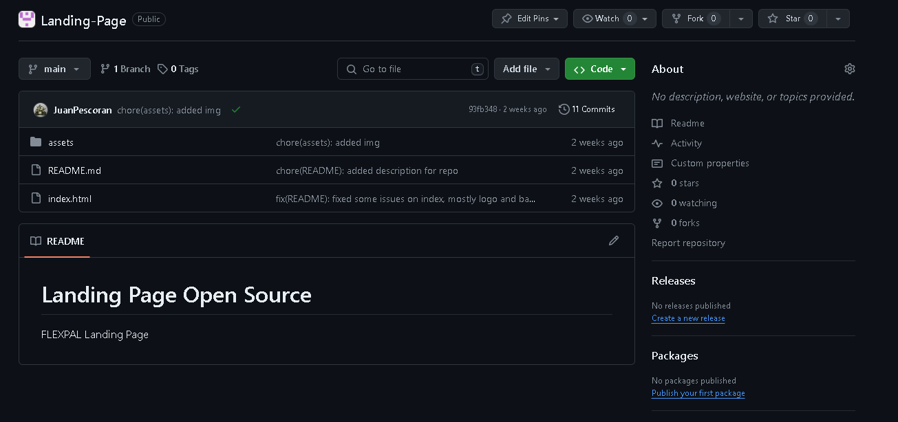
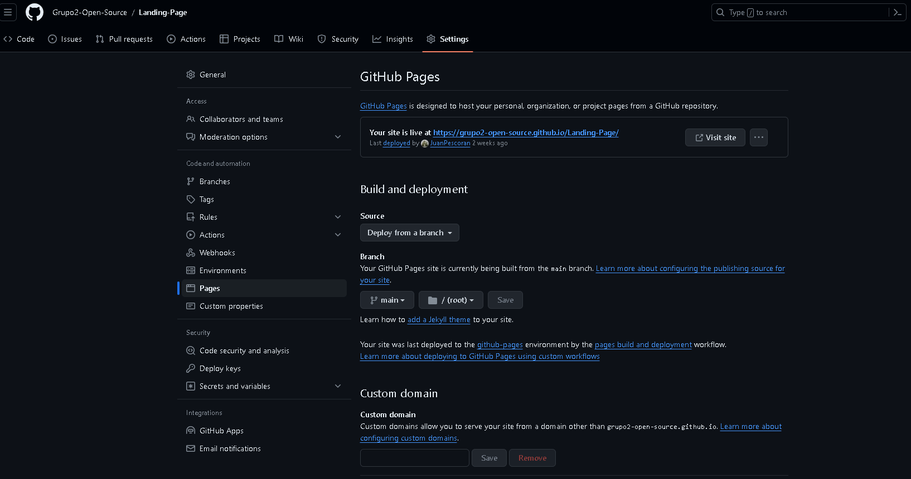

## 5.1. Software Configuration Management.
### 5.1.1. Software Development Environment Configuration.
Se muestra cada herramienta utilizada en el proyecto, para que el equipo pueda desarrollar cada punto del trabajo:
- UXPressia: Una plataforma colaborativa que facilita la creación de perfiles de usuarios y se integra con diversos mapas para evaluar sus prioridades.
- Figma: Una herramienta colaborativa que posibilita la elaboración de wireframes y maquetas.
- Vertabelo: Una plataforma colaborativa que permite la creación del diagrama de la base de datos.
- GitHub: Un repositorio colaborativo en la nube.
- WebStorm: Un entorno de desarrollo integrado (IDE) que utilizaremos para trabajar con JavaScript.
- HTML: Un lenguaje utilizado para la creación de páginas web.
- CSS: Una tecnología empleada para dar estilo a nuestras páginas web.

### 5.1.2. Source Code Management.
Operamos con dos ramas principales:
- Main: La rama principal donde presentamos nuestras publicaciones oficiales.
- Develop: Nuestra rama de desarrollo, donde probamos e integramos las funcionalidades trabajadas.
 Link del repo landing page: https://github.com/Grupo2-Open-Source/Landing-Page 
### 5.1.3. Source Code Style Guide & Conventions.
Para llevar a cabo nuestro proyecto, hemos empleado:
- Tecnologías: Incorporamos algunas de estas tecnologías en el desarrollo de nuestra aplicación, como HTML5 y CSS.  
- Herramientas: Utilizamos las tecnologías más populares y recomendadas para el desarrollo de nuestra aplicación, como GitHub, Figma y WebStorm.

### 5.1.4. Software Deployment Configuration.
A continuación, se detallará el proceso de implementación de nuestra landing page en la plataforma GitHub:

- Comenzamos creando un repositorio remoto en GitHub.
- Iniciamos el repositorio local utilizando el comando "git init".
- Luego, agregamos el repositorio remoto y transferimos los archivos a la nube de GitHub.
- Guardamos la configuración correspondiente.
- Finalmente, confirmamos el despliegue de nuestra página web una vez completado todo el procedimiento.

## 5.2. Landing Page, Services & Applications Implementation.
### 5.2.1. Sprint 1
### 5.2.1.1. 
El sprint planning es una reunión en la metodología ágil donde el equipo planifica las actividades del próximo sprint. Define qué trabajo se hará, cuánto tiempo tomará y quién será responsable. El objetivo es establecer un plan claro y alcanzable para el equipo, fomentando la colaboración y asegurando que todos estén alineados en cuanto a objetivos y prioridades.
<table  style="text-align: center;">
    <tbody>
        <tr>
			<td colspan="1">Sprint #</td>
            <td colspan="1"> Sprint 1  </td>
		</tr>
        <tr>
			<td colspan="2">Sprint Planning Background </td>
		</tr>
        <tr>
			<td colspan="1">Date</td>
            <td colspan="1"> 2024-04-10 </td>
		</tr>
        <tr>
			<td colspan="1">Location</td>
            <td colspan="1">Microoft Teams (Reuniones Virtuales)</td>
		</tr>
        <tr>
			<td colspan="1">Prepared By</td>
            <td colspan="1"></td>
		</tr>
        <tr>
			<td colspan="1"> Attendees (to planning meeting)</td>
            <td colspan="1"></td>
		</tr>
         <tr>
			<td colspan="1">Sprint 1 – 1 Review Summary </td>
            <td colspan="1"></td>
		</tr>
         <tr>
			<td colspan="1">Sprint 1 – 1 Retrospective Summary </td>
            <td colspan="1"></td>
		</tr>
         <tr>
			<td colspan="2">Sprint Goal & User Stories </td>
		</tr>
         <tr>
			<td colspan="1">Sprint 1 Goal s </td>
            <td colspan="1"></td>
		</tr>
        <tr>
			<td colspan="1">Sprint 1 Velocity </td>
            <td colspan="1"></td>
		</tr>
        <tr>
			<td colspan="1">Sum of Story Points </td>
            <td colspan="1"></td>
		</tr>
</tbody>
</table>

### 5.2.1.2. Sprint Backlog 1.
### 5.2.1.3. Development Evidence for Sprint Review.
### 5.2.1.4. Testing Suite Evidence for Sprint Review.

Se ha omitido la sección de la aplicación web debido a que solo se ha desarrollado la Landing Page. Se ofrecerá más información sobre la aplicación en una etapa posterior del desarrollo.

### 5.2.1.5. Execution Evidence for Sprint Review.

En esta entrega, el equipo de desarrolladores pertenecientes a Gymfinity ha completado con éxito la implementación y el lanzamiento de la página de la Landing Page. Esta página presenta diferentes secciones que brindan información detallada sobre nuestro producto.

### 5.2.1.6. Services Documentation Evidence for Sprint Review.

En esta entrega, el equipo de desarrolladores de FlexPal ha completado con éxito la implementación y el lanzamiento de la página de la Landing Page. Esta página presenta diferentes secciones que brindan información detallada sobre nuestro producto.

### 5.2.1.7. Software Deployment Evidence for Sprint Review.
Para el despliegue de la Landing Page primero creamos el repositorio
indicado con ramas necesarias.
  

Imagen (??) - Deploy Landing Page
  
Para último, utilizando la herramienta de GitHub Pages completamos
la información que nos piden como la fuente y rama de donde
desplegaremos el trabajo, y luego de ellos nos brindará el link de
nuestro sitio web desplegado.
  

Imagen (??) - Deploy Landing Page
 

### 5.2.1.8. Team Collaboration Insights during Sprint.
Durante el sprint, cada miembro del equipo de Gimfinity participó de forma activa y constante en la realización de las tareas asignadas, demostrando progreso de manera individual:
  

 
Imagen (??) - Team Collaboration

### Conclusiones

### Bibliografia

### Anexos

